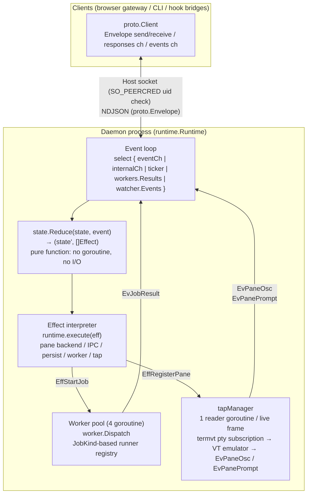
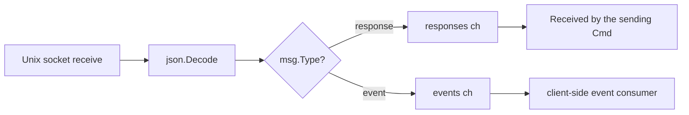
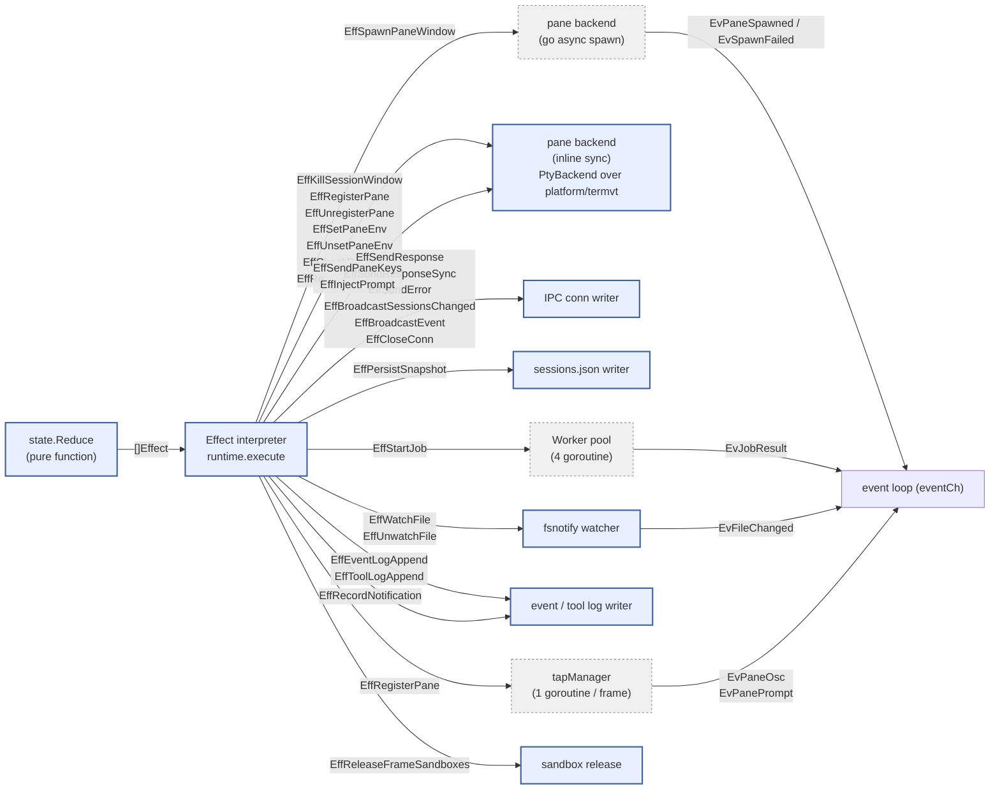
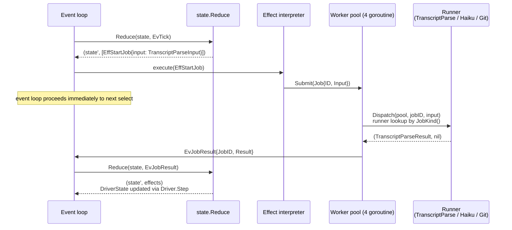
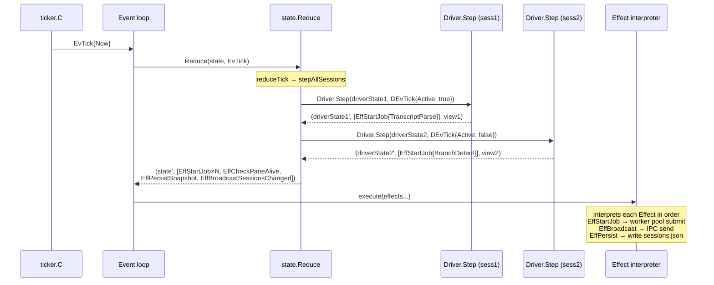
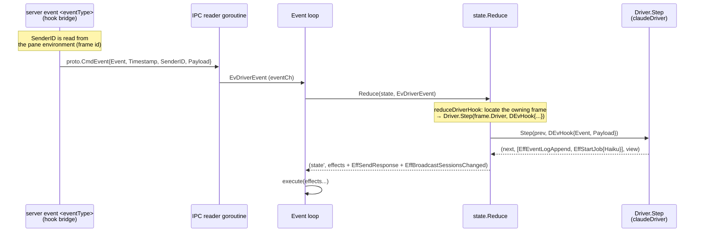
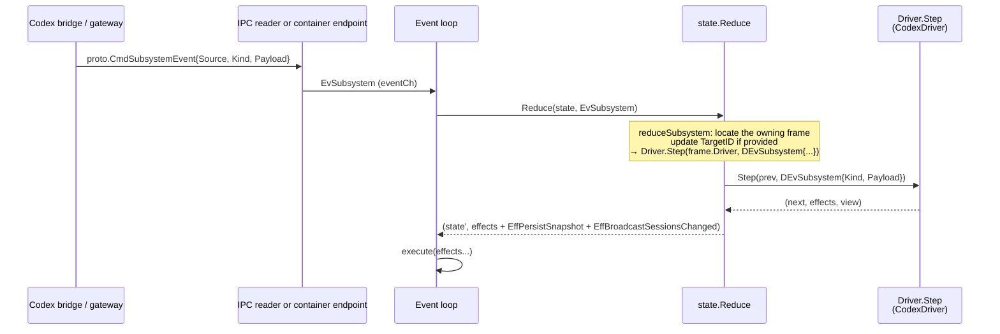

# Inter-Process Communication (IPC) and Tool System

## Inter-Process Communication (IPC)

JSON messaging over Unix domain sockets. Two physical endpoints serve different client classes:

| Endpoint | Path | Auth | Clients |
|---|---|---|---|
| **Host** | `<dataDir>/server.sock` | SO_PEERCRED UID check | co-resident HTTP/WS gateway, `server event` hook bridges, the `scripts/setup-{claude,codex,gemini}.sh` setup scripts (indirectly via the running backend) |
| **Container** | `<dataDir>/run/<project-hash>/server.sock` | Bearer token (`ROOST_SOCKET_TOKEN`) | Sandboxed agent processes inside devcontainers |

The host endpoint exposes the full command surface. The container endpoint accepts `hook-event` and `subsystem-event`; all other commands are structurally absent (no handler registered, not a filter). See [Sandbox Backends](../platform/sandbox.md#container-ipc-endpoint) for security properties.

### Topology



`runtime.Runtime` is the sole state owner. `state.State` is a pure value type that only round-trips as an argument and return value of `Reduce`. The effect interpreter performs pane-backend operations, IPC sends, persistence, and worker pool submits, feeding results back to the event loop as `Event`s.

**Runtime composition**:
- `state`: `state.State` — all domain state (Sessions map, Active, Subscribers, Jobs). Solely owned by the event loop goroutine
- `eventCh`: channel where external goroutines (IPC reader, worker pool, fsnotify watcher, tap readers) submit Events
- `workers`: `worker.Pool` — fixed-size (4) goroutine pool. `worker.Dispatch` dispatches via registered runner lookup using `JobInput.JobKind()`
- `taps`: `*tapManager` — per-frame PaneTap reader goroutines. Started on `EffRegisterPane`, stopped on `EffUnregisterPane`. `PtyPaneTap` subscribes directly to the per-frame pty managed by `platform/termvt`; the raw byte stream feeds a per-frame VT emulator (`driver/vt.Terminal`), which fires synchronous callbacks for OSC notifications, window titles, and OSC 133 prompt phases. Callbacks enqueue `EvPaneOsc` / `EvPanePrompt` into `eventCh`
- `conns`: `map[ConnID]*ipcConn` — connection management. Solely owned by the event loop goroutine
- `cfg.Backend` / `cfg.Persist` / `cfg.EventLog` / `cfg.Watcher`: backend interfaces (replaceable with fakes during testing). Production wires `PtyBackend` (over `platform/termvt`) into `cfg.Backend`

### Communication Patterns

| Pattern | Direction | Characteristics | Example |
|---------|-----------|-----------------|---------|
| **Request-Response** | Client → Daemon → Client | Synchronous. Client blocks waiting on response ch | `create-session`, `list-sessions`, `surface.read_text` |
| **Event Broadcast** | Daemon → all subscribed clients | Asynchronous. Delivered to all subscribed clients | `sessions-changed`, `agent-notification`, `peer-message` |

`SessionInfo` is a unified type that carries static metadata and dynamic state in a single message: the runtime's `broadcastSessionsChanged` retrieves status / title etc. from each Session's `Driver.View(sess.Driver)` and packs them into `proto.SessionInfo`. `reduceTick` emits `EffBroadcastSessionsChanged` on every tick, delivering to all subscribers.

Responses are sent uniformly via the `sendResponse` method. Broadcasts are delivered only to clients that have sent the `subscribe` command.

### Message Format

All messages are represented as `proto.Envelope` structs, serialized as newline-delimited JSON (NDJSON). The `Type` field discriminates the message type.

| Field | Purpose |
|-------|---------|
| `type` | `"cmd"` / `"resp"` / `"evt"` |
| `req_id` | Correlates request-response pairs |
| `cmd` | Command name (when type=cmd) |
| `name` | Event name (when type=evt) |
| `status` | `"ok"` / `"error"` (when type=resp) |
| `data` | Typed payload (`json.RawMessage`) |
| `error` | Error details (when status=error) |

Command / Response / ServerEvent are closed sum types. See [interfaces.md](interfaces.md#interfaces) for detailed Go type definitions.

### Commands (Client → Server)

| Wire Command | Parameters | Function |
|---------|------------|----------|
| `subscribe` | filters (optional) | Start receiving broadcasts |
| `unsubscribe` | - | Stop receiving broadcasts |
| `event` | event, timestamp, sender_id, payload | Unified event envelope — domain operations and driver hooks (see below). **Host endpoint only.** |
| `hook-event` | token, hook, timestamp, payload | Driver hook notification from a sandboxed agent. **Container endpoint only.** Token resolves to the owning frame server-side. |
| `subsystem-event` | token, source, kind, timestamp, payload | Structured subsystem event from a sandboxed backend. **Container endpoint only.** Token resolves to the owning frame server-side. |
| `surface.read_text` | session_id, lines | Read the trailing N lines of the active pane's VT snapshot |
| `surface.send_text` | session_id, text | Send text followed by Enter to the session's active pane |
| `surface.send_key` | session_id, key | Send a named key (e.g. `Escape`, `q`) without Enter |
| `driver.list` | - | List available driver names and display names |

#### Event Types (via `CmdEvent.Event`)

Domain operations and hook-driven agent events are dispatched via `CmdEvent`. Session-domain operations are registered via `RegisterEvent[T]` and dispatched to typed handlers. Hook-driven events (those with `SenderID` set) are routed as `EvDriverEvent` to the owning frame's driver. Structured backends such as Codex App Server use `CmdSubsystemEvent` and route through `EvSubsystem`.

| Event Type | Payload | Function |
|------------|---------|----------|
| `create-session` | project, command, options | Create a new session (root frame). `options` normalizes driver-agnostic launch flags such as `worktree.enabled` |
| `push-driver` | session_id, project, command, options | Append a new driver frame on top of an existing session's active frame |
| `stop-session` | session_id | Stop a session (terminates every frame in its stack) |
| `list-sessions` | - | Retrieve session list |
| `shutdown` | - | Shut down the daemon |
| *(driver hooks)* | driver-specific | Hook events from hook-driven agents such as Claude and Gemini. `SenderID` is the frame id; the reducer locates the owning frame across all sessions and routes the hook to that frame's driver |
| *(subsystem events)* | source, kind, payload | Structured execution events emitted by a subsystem. Codex App Server uses this path for thread lifecycle, tool execution, approvals, plan, diff, and assistant message updates |

### Client Message Routing



### Concurrency Model — Single Event Loop + Worker Pool

The daemon is composed of a **single event loop + fixed-size worker pool**. All domain state (`state.State`) is solely owned by the event loop goroutine, and state transitions are expressed as the pure function `state.Reduce(state, event) → (state', []Effect)`. No `sync.Mutex` exists in the domain layer (except inside the worker pool).

#### Event Loop and State Ownership

```
runtime.Runtime.Run() — single goroutine
├── select {
│   ├── eventCh     — Events from IPC reader / event bridge
│   ├── internalCh  — conn open/close (runtime internal events)
│   ├── ticker.C    — EvTick at 1-second intervals
│   ├── workers.Results() — EvJobResult from worker pool
│   └── watcher.Events()  — EvFileChanged from fsnotify
│   }
├── dispatch(ev):
│   ├── state.Reduce(r.state, ev) → (next, effects)
│   ├── r.state = next
│   └── for _, eff := range effects { r.execute(eff) }
└── state: state.State (Sessions, Active, Subscribers, Jobs, ...)
    → solely owned by event loop goroutine. No mutex needed
```

#### Effect Interpreter Dispatch

`runtime.execute(eff)` maps each Effect type to backend I/O. Since Effect is a closed sum type, all side effects can be enumerated via `grep`:



Legend:
- **Solid border** = executed synchronously on the event loop goroutine
- **Dashed border** = executed asynchronously in a separate goroutine. Results are fed back to the event loop as Events

**`EffSendResponse` vs `EffSendResponseSync`**: the former enqueues the wire frame on the connection's writer-goroutine outbox and returns immediately. The latter writes directly to the socket from the event loop goroutine, guaranteeing the response reaches the kernel buffer before the next effect in the same Reduce cycle runs. The sync form is used when a subsequent effect in the same cycle will tear down the connection or shut down the daemon — e.g. the `shutdown` reply must land before the connection-closing effect drops the socket.

#### Worker Pool (Off-Loop Execution of Slow I/O)

Heavy I/O (transcript parse, haiku summary, git branch detect) is executed outside the event loop in a fixed-size worker pool (`worker.Pool`, 4 goroutines). Runners are registered via `RegisterRunner[In,Out]` by the driver at init time, and `Dispatch` looks them up by `JobInput.JobKind()`:



Key points:
- **The event loop never blocks**: EffStartJob only submits to the worker pool. Results return asynchronously as EvJobResult
- **Fixed goroutine count**: event loop (1) + IPC accept (1) + worker pool (4) + IPC reader/writer (per client). Independent of session count
- **Type-based runner registration**: `worker.RegisterRunner("transcript_parse", runner)` — adding a new job type requires only one RegisterRunner call + a runner function + a JobKind() method

#### Tick Processing Sequence

On each tick, `state.Reduce` calls Driver.Step for all sessions and returns the necessary Effects (transcript parse / branch detect job, broadcast, persist):



#### Hook and Subsystem Event Routing

**Host frames**: `CmdEvent` (with `SenderID` set to the frame's env var) → IPC reader → event loop → `reduceDriverHook` → `Driver.Step(DEvHook)`.

**Sandboxed frames**: `CmdHookEvent` (with bearer token) → container endpoint accept loop → token Lookup → `EvDriverEvent{SenderID: resolvedFrameID}` → event loop → `reduceDriverHook` → `Driver.Step(DEvHook)`. The client-supplied frame ID is not used; the token resolves it server-side.

**Structured backends**: `CmdSubsystemEvent` (host or container bearer-token path) → IPC reader / container endpoint → `EvSubsystem{FrameID: resolvedFrameID}` → event loop → `reduceSubsystem` → `Driver.Step(DEvSubsystem)`.

Hook-driven agents converge at `EvDriverEvent`; structured backends converge at `EvSubsystem`. See [state-monitoring.md](state-monitoring.md) for the driver-side handling details.

#### Resident Goroutines

| Goroutine | Count | Role |
|-----------|-------|------|
| `Runtime.Run` (event loop) | 1 | State ownership + Reduce + Effect interpretation |
| `acceptLoop` (host) | 1 | Accepts new connections on `server.sock`; performs SO_PEERCRED uid check before admitting |
| container endpoint accept | 1 per active project | Accepts connections on per-project `<run-hash>/server.sock`; bearer token is validated per-message |
| `ipcConn.readLoop` | M (1 / client) | IPC reader. Converts Commands to Events and submits to eventCh |
| `ipcConn.writeLoop` | M (1 / client) | IPC writer. Drains outbox and writes to socket |
| `worker.Pool.run` | 4 (fixed) | Worker pool goroutines |
| `tapManager.readTap` | N (1 / live frame) | PaneTap reader. Feeds the raw byte stream from the per-frame pty via `platform/termvt` subscription into a per-frame VT emulator, which fires callbacks that emit `EvPaneOsc` (window titles + OSC 9/99/777 notifications) and `EvPanePrompt` (OSC 133 phases) into eventCh |

IPC reader/writer scales with client count; tap readers scale with live frame count. Both are continuous sources that only emit events — they never read or write `state.State`.

#### Hook Event Routing Sequence



#### Subsystem Event Routing Sequence



### IPC Type Design Invariants

`Cmd*`, `Resp*`, and `Evt*` types in `src/proto/` follow these invariants:

- **Optional fields use `omitempty`; zero value means absent.** A zero value with distinct semantics belongs in a separate type.
- **Names are client-agnostic.** No client-specific terms (browser / CLI / hook / orchestrator) in field or type names; every client consumes the same types.
- **Every concrete type carries its marker methods** (`isCommand()` / `CommandName()`, `isEvent()` / `EventName()`, `isResponse()`).
- **`state.View` is written by the driver only.** Browser and any future native clients read state; neither branches on driver name (see Driver isolation in `ARCHITECTURE.md`).

Commands in the `surface.*` and `driver.*` namespaces use dotted names within the same `proto.Envelope` format — no protocol change is required to add new namespaces.

## Tool System

High-level user operations are abstracted as `Tool`s. Each Tool wraps a typed IPC command sequence and is surfaced uniformly to every client: the browser via the gateway's REST API (`POST /api/sessions`, etc.) and host-side helpers via the same IPC.

```go
// tools/tools.go
type Tool struct {
    Name        string
    Description string
    Params      []Param
    Run         func(ctx *ToolContext, args map[string]string) (*ToolInvocation, error)
}

type Param struct {
    Name    string
    Options func(ctx *ToolContext) []string  // generates choices at runtime
}

type ToolContext struct {
    Client *sessions.Client // typed IPC connection to daemon (sessions.Wrap(*proto.Client))
    Config ToolConfig       // tool config (commands, projects)
    Args   map[string]string
}
```

### Tool to IPC Command Mapping

A Tool's `Run` sends typed IPC commands via `ToolContext.Client` (`sessions.Client`, which wraps `proto.Client`). Each Tool corresponds to one IPC command. By returning a `ToolInvocation`, tools can chain follow-up tools within the same invocation (e.g., `create-project` → `new-session`).

| Tool | IPC Command | Parameters |
|------|-------------|------------|
| `new-session` | `create-session` | project, command |
| `stop-session` | `stop-session` | session_id |

Tools target high-level operations with side effects (create, stop, etc.). Side-effect-free lookups such as session listing or surface reads bypass the Tool layer and are sent directly as IPC commands by the calling client.

### Parameter Completion

Tool parameter values are resolved by each `Param`'s `Options` callback. The completion flow is: tool selection → dynamically generate choices via `Options` → incremental filtering by user input → execute `Tool.Run` once every parameter is bound. Effects of the invocation reach every subscribed client via the `sessions-changed` broadcast.
