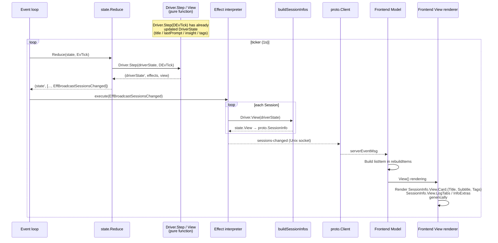
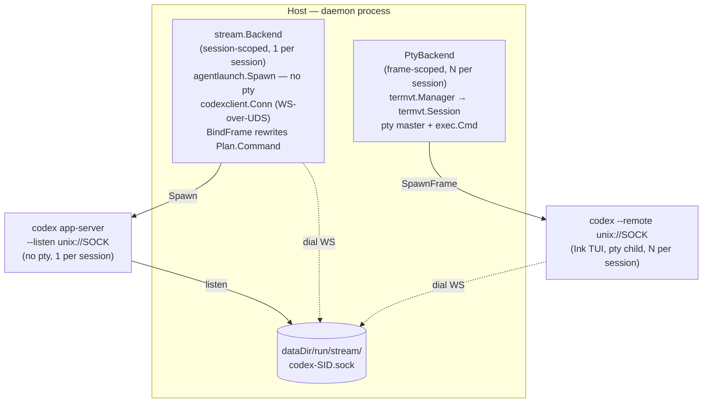
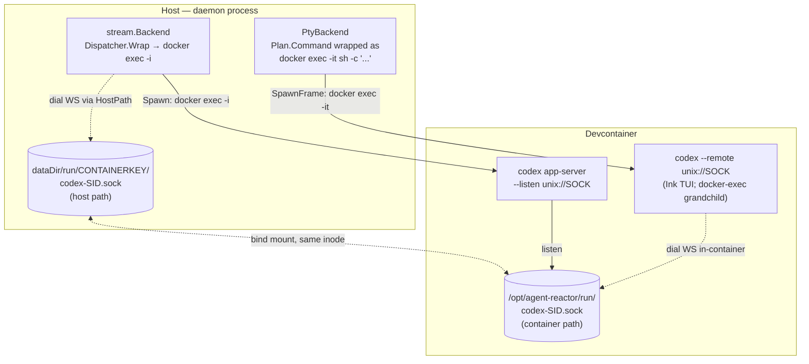

# Process Model, Frame Model, and Rendering Responsibilities

## Rendering Responsibilities

agent-reactor rendering divides responsibilities between the driver and the browser frontend at the following boundaries. **When adding a new driver, you do not need to touch the runtime or the frontend code**. A driver only needs to implement `View(DriverState) state.View`.

### Driver-Owned (`SessionView`)

The driver returns `View(DriverState) state.View`. It is a pure function that performs no I/O or detection (heavy processing is already reflected in DriverState via `Step(DEvTick)`).

- `Card.Title`: First line (e.g., conversation title)
- `Card.Subtitle`: Second line (e.g., most recent prompt)
- `Card.Tags`: Identity chips. **The driver directly determines colors** (Tags carry `Foreground` / `Background`)
  - The command name is displayed via `View.DisplayName` and `Card.BorderTitle`. Tags contain only branch names, etc.
- `LogTabs`: Additional log tabs (label + absolute path + kind). kind is a TabKind constant defined by the driver (the generic `TabKindText` is provided by state; driver-specific kinds are defined in each driver package)
- `InfoExtras`: Driver-specific lines in the INFO tab
- `SuppressInfo`: Opt-out of the INFO tab (explicitly set by driver)
- `StatusLine`: Pre-rendered status string (consumed by the frontend's session header)

### Frontend-Owned

The browser frontend (`client/web` xterm.js bundle, served by the `web` host binary and proxied through `cmd/server`'s gateway) acts as a driver-agnostic generic renderer.

- Rendering of `SessionInfo` generic fields (ID / Project / Command / CreatedAt / State / StateChangedAt)
- Color selection from `State` enum values — universal state colors are consistent across all drivers
- Elapsed time formatting (relative notation like `5m ago`)
- Card layout (ordering of each slot / margins / wrap / truncate)
- INFO tab generic header (auto-generated from SessionInfo generic fields → driver's `InfoExtras` appended at the end)
- LOG tab (always tails `~/.agent-reactor/server.log`)
- Filter / fold / cursor restoration

### Prohibitions

- **Do not branch on driver name in the frontend** (code like `if cmd === "claude" {...}` is prohibited). Verifiable by grep:
  ```sh
  grep -rn '"claude"\|"bash"\|"codex"\|"gemini"' src/client/web/src/  # → should return 0 results
  ```
- **Drivers must not depend on any presentation library or the web frontend** (no import of `client/web`, xterm.js, or any UI runtime)
- **Drivers must not perform I/O** (delegate to runtime via Effects like EffEventLogAppend, EffStartJob, etc.)
- **Runtime must not call driver-specific I/O directly** (runtime only interprets Effects; driver-specific I/O is executed by worker pool runners)

### Tag Colors Are Driver-Owned, State Colors Are Frontend-Owned — Why the Different Ownership?

- **State** concepts (idle / running / waiting / error) and their colors **should be consistent across all drivers**. Users would be confused if the same state appeared in different colors → centralized in the frontend theme
- **Tags** are driver-specific (branch tag, command tag, ...). What to display and what color are up to the driver → driver-owned
- If tag caching/persistence is needed, the driver holds it in the `PersistedState` bag (e.g., claudeDriver's `branch_tag` / `branch_target` / `branch_at`)

### Rendering Flow (driver → runtime → IPC → frontend)

The driver's `View(driverState)` produces the UI payload, runtime's `buildSessionInfos` packs it into `proto.SessionInfo`, broadcasts it via IPC through `EffBroadcastSessionsChanged`, and the frontend renders it generically **without branching on driver name**. The diagram below shows the flow that occurs on each tick:



Key points:
- Runtime's `buildSessionInfos` packs `state.View` directly into `proto.SessionInfo.View` and transports it. The frontend renders `SessionInfo.View.*` fields generically.
- StatusLine travels on the same `proto.SessionInfo.View` payload: the active session's `Driver.View().StatusLine` is what the frontend displays in the session header.

## Process Model

The `server` binary has one long-lived form (the merged backend) and a small set of short-lived one-shot subcommands. All agent hook registration is owned by the runtime itself (`client/lib/agenthook`), invoked from the daemon boot path on the host and from the devcontainer postCreate inside containers — there are no `scripts/setup-*.sh` shims left in the tree:

```
server -data-dir <dir>             → Backend daemon (Runtime event loop + IPC server)
                                     + co-resident HTTP/WS gateway (cmd/server)
                                     also: register host hooks for every supported
                                           agent at boot (Claude / Gemini today)
server event <eventType>           → Hook event receiver (short-lived process invoked by an agent hook)
server host-exec <bin> [args ...]  → Host-exec broker shim (run inside a sandboxed container)
server mcp-exec <alias>            → MCP-proxy shim (run inside a sandboxed container)

reactor-bridge claude-setup-hooks   → Claude hook registration inside the devcontainer
reactor-bridge gemini-setup-hooks   → Gemini hook registration inside the devcontainer
                                      (both called from the devcontainer postCreate by coordinator.go;
                                       Codex has no hooks — it is integrated via the app-server protocol)
```

There is exactly **one** long-lived backend process — `server`. It owns both the daemon coordinator (event loop, IPC sockets, persistence) and a co-resident HTTP/WebSocket gateway goroutine that exposes the browser surface. The separate `web` binary serves the React/xterm.js bundle and reverse-proxies REST/WS to that gateway.

### Daemon (Runtime)

The daemon is the single long-running process that owns all session state. Concretely it runs:

- the Runtime event loop (`select` over eventCh / ticker / workers / fsnotify),
- the IPC server (host endpoint plus per-container endpoint),
- the worker pool that executes Effects against drivers and backends,
- `tapManager`, which holds one reader goroutine per frame fanning the per-frame pty stream out to subscribers (the browser frontend's xterm.js terminal connects through this fanout via `server/web`).

```
runDaemon()
├── Register drivers (driver.RegisterDefaults)
├── Build worker pool (worker.NewPool + RegisterDefaults)
├── Build Runtime (runtime.New) with PtyBackend over platform/termvt.Manager
├── LoadSnapshot — restore each session's frame stack from sessions.json
├── Cold-start bootstrap
│   └── RecreateAll — for each session, walk frames root-to-tail and
│                     Driver.PrepareLaunch(LaunchModeColdStart, …) using
│                     the persisted LaunchOptions; emitted EffSpawnFrame
│                     drives termvt.Manager to allocate a fresh pty session
│                     keyed by string(FrameID)
├── rt.Run(ctx) — start event loop goroutine
│                 tapManager starts a reader goroutine per frame on EffRegisterFrame;
│                 each reader feeds the raw pty stream into a VT emulator and
│                 emits EvFrameOsc / EvFramePrompt into eventCh. tapManager.stopAll()
│                 is called on ctx cancel.
│                 defer stack tears down in reverse: deactivateBeforeExit → EventLog.CloseAll
│                 → shutdownIPC → workers.Stop (bounded 500ms; pool ctx cancels runner
│                 subprocesses via SIGKILL) → close(done)
├── rt.StartIPC() — start Unix socket server
├── FileRelay startup — push monitoring for log/transcript files
└── Block on ctx until SIGINT/SIGTERM or explicit shutdown
```

**Cold start is the only startup mode** because `PtyBackend` is backed by an in-process `platform/termvt.Manager` whose session table is empty at every daemon boot — no pty survives the daemon process. The bootstrap therefore always walks the restored frame stack and calls `Driver.PrepareLaunch(LaunchModeColdStart, …)` for each frame, using the normalized `LaunchOptions` persisted alongside the frame's `driver_state`. `sessions.json` is the source of truth for what to restore.

The `RespawnFrame` interface still exists on `FrameLifecycle` and `PtyBackend` implements it as a teardown + recreate via the termvt.Manager, but the cold-start bootstrap path does not use it — fresh launches go through `EffSpawnFrame`.

For Codex, the daemon starts **one `codex app-server` per session managed by the client** (keyed by `stream:session:<sessionID>`). All frames within the same Session (root + peers) share one app-server; different Sessions get separate processes. The app-server is launched via `agentlaunch.Dispatcher.Wrap` + `agentlaunch.Spawn` (argv-direct, no host shell); the listen argv is built by `libcodex.AppServerListenArgs`, binding a per-session UDS `codex-<sessionID>.sock`. The path the app-server binds comes from `Factory.ResolveSockPath` (container-absolute under the run dir in container mode); the host-side path the daemon dials is derived from that path plus the launch's bind mounts (`resolveDialSock` → `WrappedLaunch.HostPath`). The stream daemon uses a dedicated non-TTY `DevcontainerLauncher` (`docker exec -i`) that shares the same `sandbox.Manager` as the per-frame interactive launcher. The daemon connects via **WebSocket-over-UDS** (HTTP Upgrade — the transport codex app-server speaks). Structured RPC events are converted to `DEvSubsystem` and dispatched to the owning frame. Each frame runs in the same sandbox as the app-server and attaches to that UDS directly with `codex --remote unix://<sock>` (cold start) or `codex resume <id> --remote unix://<sock>` (warm start); these remote-attach strings are built by `libcodex.RemoteAttachArgs`. There is no TCP routing bridge. Codex state is not driven by hooks. When a session's last frame is released, `Factory.Remove` stops the corresponding app-server process (reap on exit).

### Codex process topology

The paragraph above compresses two spawn paths, two daemon-internal backends, and a host/container boundary into one line. Concretely, a Codex client-Session runs **1 + N processes**: one `codex app-server` shared across the session's frames, and one `codex --remote` TUI per frame. `stream.Backend` and `PtyBackend` own the two spawn paths independently — `stream.Backend` is *not* layered on top of `PtyBackend`.

| Component | Scope | Layer | Spawns | pty? |
|---|---|---|---|---|
| `stream.Backend` (`client/runtime/subsystem/stream/`) | session (`SubsystemID` keyed on session) | `Subsystem` interface | `codex app-server --listen unix://...` via `agentlaunch.Spawn` (argv-direct) | no — plain stdio pipes, `procgroup` |
| `PtyBackend` (`client/runtime/pty_backend.go`) | frame (1 per FrameID) | `FrameBackend` interface | rewritten `Plan.Command` = `codex --remote unix://...` via `termvt.Manager` | yes — `/dev/ptmx` master owned by daemon |

Every Codex frame flows through **both**: `stream.Backend.BindFrame` binds a thread on the app-server and rewrites `Plan.Command`, then `PtyBackend.SpawnFrame` runs that rewritten command in a pty.

#### Host mode



#### Devcontainer mode



Reading notes:

- **The pty master always lives on the host** — it is created by `termvt.NewSession` (`platform/termvt/session.go:79`, `pty.StartWithSize`) inside the daemon process. In devcontainer mode the pty's immediate child is the `docker exec` CLI on the host; the actual `codex --remote` TUI runs in the container as its grandchild.
- **The dial socket and the listen socket are the same file.** In devcontainer mode the listen path is container-absolute and the dial path is its host-side alias via bind mount; `resolveDialSock` → `WrappedLaunch.HostPath` (`stream/backend.go:182`) is the translator. In host mode the two paths are identical.
- **Client disconnect / reconnect does not touch either process.** `reduceConnClosed` only tears down `Subscribers` / `SurfaceSubs` and emits `EffSurfaceSubscribeStop`; it never emits `EffKillFrame` or stops the subsystem. Both the app-server and the per-frame TUI survive until the frame is explicitly killed (or, for the app-server, until `reapSubsystemIfLast` runs after the session's last frame is released).
- **Thread selection is done by the daemon, not the TUI.** `libcodex.RemoteAttachArgs` deliberately does not pass `resume <id>` — `stream.Backend.bindThread` has already called `thread/start` or `thread/resume` on the app-server before the TUI connects (`platform/lib/codex/argv.go:78-81`).
- **This two-process topology is Codex-specific.** Claude / Gemini drivers do not set `Plan.Subsystem`, so `ensureSubsystemOnce` falls back to `LaunchSubsystemCLI` (`interpret_spawn.go:272-274`) and only the per-frame CLI process is spawned — no app-server counterpart.

### Shutdown semantics

| Trigger | sessions.json | Sandboxes | Next boot |
|---|---|---|---|
| Explicit `shutdown` command | Saved | Destroyed via `EffReleaseFrameSandboxes` | Cold start creates fresh containers |
| SIGINT / SIGTERM (ctx cancel) | Saved | **Preserved** (no `EffReleaseFrameSandboxes`) — containers survive | Cold start adopts surviving containers where it can; `BeginColdStart` discards any container the matching cold-start path cannot reuse |
| SIGKILL / panic (cleanup defers do not run) | Last persisted snapshot remains | Orphaned containers from missing projects are reaped by `PruneOrphans` at next startup | Cold start as above |

`sessions.json` is **always preserved** — it is the restoration source for cold start. See [Sandbox Backends — Cold-start fresh provisioning](../platform/sandbox.md#design-decisions) for the container-side handshake.

### Frame Model

Each frame owns exactly one pty session allocated by `platform/termvt.Manager`. The `termvt.Manager` session key is `string(FrameID)` — there is no separate physical-handle namespace at the backend. The runtime's `EffSpawnFrame` asks the backend to create the pty session; success comes back as `EvFrameSpawned` (failure as `EvSpawnFailed`) and registration is recorded via `EffRegisterFrame`. The browser frontend subscribes to per-frame output via the `server/web` WebSocket gateway, which connects to `tapManager`'s fanout for the corresponding frame id. Key input from the frontend travels back through `FrameIO.SendKeys` / `SendKey` / `SendEnter`.

### Failure Behavior

- **Frame command exits**: termvt reports the session ended; `reduceTick` emits `EffReconcileWindows`, runtime compares the live backend frame table against state.Sessions and emits `EvFrameVanished` / `EvFrameCommandExited` for the missing frames. The reducer truncates the owning session at the dead frame's index — if it was the root frame, the whole session is deleted; otherwise the remaining lower frames stay and the new tail becomes the active frame. State is updated, the snapshot is rewritten, and `sessions-changed` is broadcast.
- **Active frame death**: the runtime probes each live frame's backend session every tick; an error that wraps `ErrFrameMissing` is treated as dead and the runtime emits `EvFrameVanished{OwnerFrameID:<active>}`, and the reducer applies the same truncate rule above.
- **Container death**: handled symmetrically — the next frame command exit reconciliation reaps the frame; sandbox cleanup runs through the normal `EffReleaseFrameSandboxes` path on explicit shutdown.
- **Daemon crash (SIGKILL)**: cleanup defers do not run, so any containers from the previous boot survive; the next daemon boot cold-starts and either adopts them or discards them via the `BeginColdStart` handshake.
- **Startup consistency**: `sessions.json` is the single source of truth at boot. Because every boot is a cold start, there is no warm-rebind step that can desynchronise with a live backend frame table — the bootstrap allocates a fresh pty session for every restored frame.
- **IPC errors**: when an IPC command returns an error on the frontend side, the gateway logs it and does not change UI state. No timeout is configured (local Unix-socket communication). If the daemon deadlocks, the client risks blocking indefinitely; recovery means killing the daemon process.
