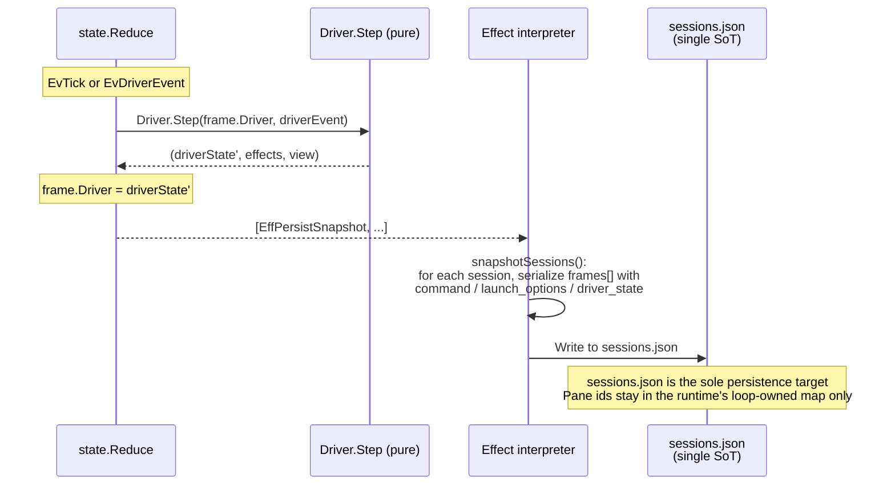
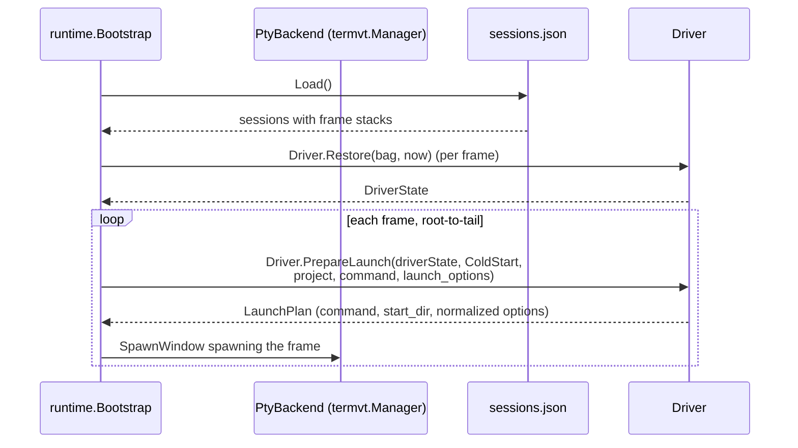

# State monitoring

For the interactive operation processing flow (client → IPC → Reduce → Effect), see [ipc.md](ipc.md). The following describes the background status update pipeline and state monitoring by Drivers.

## Background pipeline

Four parallel event sources feed Driver.Step:

- **Periodic tick (1s)**: `reduceTick` steps the active frame of each running session via `Driver.Step(frame.Driver, DEvTick{...})`. Pane reconciliation and per-frame pane health checks are performed on the same tick. For the detailed sequence, see [ipc.md](ipc.md#tick-processing-sequence).
- **PaneTap OSC events**: When the `tapManager` reader goroutine receives bytes from the per-frame pty (via `PtyPaneTap` over `platform/termvt`), it feeds them into a per-frame `driver/vt.Terminal` (a thin wrapper over `charmbracelet/x/vt`). The emulator fires synchronous callbacks for OSC 0/2 (window titles), OSC 9/99/777 (notifications), and OSC 133 (semantic prompt phases). The reader translates these into `EvPaneOsc` and `EvPanePrompt` events.
- **Driver hooks (`EvDriverEvent`)**: hook subprocesses send events through the IPC bridge; `reduceDriverHook` dispatches them to the owning frame's driver as `DEvHook`.
- **Subsystem events (`EvSubsystem`)**: structured backends send typed execution events through the IPC bridge; `reduceSubsystem` dispatches them to the owning frame's driver as `DEvSubsystem`.

Driver.Step returns `[]Effect` — `EffStartJob` for slow I/O (transcript parse, haiku summary, git branch detect), `EffEventLogAppend` for operator-visible event log writes, and so on. Worker results are fed back via `EvJobResult` → `Driver.Step(DEvJobResult)` and reflected in DriverState.

## State monitoring

The Driver plugin's `Step` method is responsible for status updates. For the Driver interface definition, see [interfaces.md](interfaces.md#interfaces).

### Lifecycle:

| Method | Caller | Purpose |
|---------|-----------|------|
| `NewState(now)` | `reduceCreateSession`, `reducePushDriver` | Generates a fresh DriverState value for a new frame. Initial values are Idle / now |
| `Restore(bag, now)` | `runtime.Bootstrap` | Reconstructs each frame's DriverState from the previously saved opaque map on warm/cold restart |
| `PrepareLaunch(s, mode, project, cmd, options)` | `reduceCreateSession`, `reducePushDriver`, cold-start bootstrap | Pure function that resolves the frame's launch plan (command / start_dir / normalized `LaunchOptions`). Called synchronously inside `state.Reduce` and on cold-start restoration; the resolved plan is baked into `EffSpawnPaneWindow` so the runtime never calls drivers |
| `PrepareCreate(s, sessID, project, cmd, options)` | `reduceCreateSession` (planner-gated drivers only) | Optional extension returning a `CreatePlan` with a `SetupJob` for async pre-launch work (e.g., creating a managed worktree) |
| `CompleteCreate(s, cmd, options, result, err)` | `handlePendingCreate` (planner-gated drivers only) | Runs after the SetupJob completes; returns the final `CreateLaunch` and the normalized `LaunchOptions` to persist on the frame |
| `Step(prev, DEvTick)` | `reduceTick` | Periodic tick on the active frame of each running session. Claude gates on `DEvTick.Active`, emitting transcript parse jobs only when active. Generic transitions Running → Waiting after `IdleThreshold` elapses without OSC activity |
| `Step(prev, DEvPaneOsc)` | `reducePaneOsc` | Routes OSC 0/2 (window title) sequences to the driver. Claude/Codex/Gemini interpret the title to update status (e.g. Braille spinner = Running, "✳" = Waiting) |
| `Step(prev, DEvPanePrompt)` | `reducePanePrompt` | Routes OSC 133 semantic-prompt events. Shell driver sets `SawPromptEvent` on first observation and updates `LastExitCode` on `PromptPhaseComplete` |
| `Step(prev, DEvHook)` | `reduceDriverHook` | Receives hook events targeted at a specific frame and updates that frame's DriverState. Used by hook-driven agents such as Claude and Gemini |
| `Step(prev, DEvSubsystem)` | `reduceSubsystem` | Receives structured subsystem events targeted at a specific frame and updates that frame's DriverState. Used by Codex App Server |
| `Step(prev, DEvJobResult)` | `reduceJobResult` | Reflects results from the worker pool into the owning frame's DriverState. Transcript parse results such as title / lastPrompt |
| `Step(prev, DEvFileChanged)` | `reduceFileChanged` | File change notification from fsnotify. Emits transcript parse job |
| `View(driverState)` | runtime's `broadcastSessionsChanged` / `activeStatusLine` | Pure getter that returns display payloads consumed by the browser frontend over IPC (Card / LogTabs / InfoExtras / StatusLine) |
| `Persist(driverState)` | runtime's `snapshotSessions` | Serializes DriverState to an opaque map. Written to sessions.json alongside the frame's command and normalized `LaunchOptions` |

### Active/Inactive and DEvTick.Active (push model)

"Session is active" means the connected client (the browser through the `server` gateway, or any future native client) is currently attached to that session. The single source of truth is `state.State.ActiveSession` (SessionID), and `reduceTick` evaluates `sessID == state.ActiveSession` when constructing `DEvTick` to set the `DEvTick.Active` flag. Step is called on the active frame of every running session on every tick, passing `DEvTick{Active: false}` to inactive sessions. Activation is detected on the next tick (within 1 second).

### Claude driver (event-driven + active-gated transcript sync)

`claudeDriver`'s status is **fully event-driven**: the status in DriverState is updated only at the moment `Step(prev, DEvHook{Event: "state-change"})` receives a state-change event. If no new event arrives, the status does not change (= the previously restored status continues to be displayed).

Transcript metadata (title / lastPrompt, etc.) is incrementally parsed by `transcript.Tracker` inside the worker pool's `TranscriptParse` runner:

- `Step(prev, DEvTick{Active: true})`: Emits transcript parse job only when active. Returns immediately when inactive
- `Step(prev, DEvHook)`: Always updates DriverState regardless of active/inactive. Also emits transcript parse job
- `Step(prev, DEvJobResult{TranscriptParseResult})`: Reflects parse results (title / lastPrompt / statusLine) into DriverState
- `Step(prev, DEvFileChanged)`: File change notification from fsnotify. Emits transcript parse job

`lastPrompt` is obtained by `transcript.Tracker` walking the parentUuid chain backwards from the tail and returning the text of the first non-synthetic `KindUser` entry.

Hook event → driver.Status mapping:

| Hook event | Status |
|--------------|--------|
| UserPromptSubmit, PreToolUse, PostToolUse, SubagentStart | Running |
| Stop, Notification(idle_prompt) | Waiting |
| StopFailure, SessionEnd | Stopped |
| Notification(permission_prompt) | Pending |
| SessionStart | Idle |
| SessionEnd | Stopped |

The `server event <eventType>` subcommand repackages the Claude hook payload into `proto.CmdEvent` and sends it via IPC. The runtime's IPC reader converts it into an `EvDriverEvent` and feeds it into the event loop. `reduceDriverHook` locates the owning frame across all sessions using the frame id it received as `SenderID`, and calls `Driver.Step(frame.Driver, DEvHook{...})`. Neither the state layer nor the runtime layer holds any Claude-specific state logic.

### Codex driver (App Server stream + display-only transcript)

`CodexDriver` is driven by structured subsystem events from `codex app-server`, not by hooks.

- `Step(prev, DEvSubsystem{Kind: session_ready | turn_started | turn_completed})`: updates running/waiting lifecycle and stores the logical thread identity
- `Step(prev, DEvSubsystem{Kind: tool_started | tool_completed | approval_requested | approval_resolved})`: updates current tool and pending approval state
- `Step(prev, DEvSubsystem{Kind: plan_updated | diff_updated | message_updated})`: updates plan summary, diff summary, assistant message, and recent turns
- `Step(prev, DEvFileChanged)` / `Step(prev, DEvJobResult)`: transcript parsing still runs, but only to populate display tabs and supplemental fields

For Codex, transcript files are display-only. The source of truth for status, approval, tool execution, plan, and diff is the App Server event stream.

### Hook event routing and race-free identification

A mechanism for the hook subprocess to identify its owning client frame in a race-free manner.

**Problem**: A hook may fire before the daemon could write any pane-scoped marker visible to the process inside the pane. Any post-spawn marker write would race with the hook.

**Solution**: Inject a frame-scoped env var into the pane environment at pane-spawn time (passed through to `platform/termvt` together with the command and argv). The env var is set at the kernel exec level simultaneously with the pty allocation, so no race occurs. The hook bridge reads the frame id directly from its own process environment. The reducer then scans the frame stacks to locate the owning frame and routes the hook to that frame's driver. Hooks whose target frame has already been truncated off the stack are silently dropped — this is the intended behavior when a frame's pane has just died and the reducer is still processing the eviction.

### OSC pipeline (pty → VT emulator → driver)

Pane status detection is OSC-driven. `PtyPaneTap` subscribes to each frame's pty via `platform/termvt` and streams the raw byte sequence into a per-frame `driver/vt.Terminal`; the emulator parses the byte stream and fires synchronous callbacks for the OSC sequences agents and shells emit:

| OSC | Source | Routing |
|-----|--------|---------|
| 0 / 2 | Window title (Claude/Codex/Gemini emit "✳ Working", "✋ Action Required", etc.) | `EvPaneOsc` → `EffEventLogAppend` (EVENTS log) + `DEvPaneOsc` to driver for status interpretation |
| 9 / 99 / 777 | Desktop notification protocols (Growl / Kitty / urxvt) | `EvPaneOsc` → `EffRecordNotification` (writes EVENTS log + dispatches optional desktop toast) |
| 133 | FinalTerm semantic prompt phases (`A`=start, `B`=input, `C`=command, `D`=complete with exit code) | `EvPanePrompt` → `EffEventLogAppend` + `DEvPanePrompt` to driver |

### Generic driver

`genericDriver` runs in a Waiting state by default. OSC events received via `DEvPaneOsc` may transition it to Running (e.g. when the pane reports a working spinner). Without OSC activity, the driver falls back to `IdleThreshold`-based decay: Running → Waiting after the configured duration elapses.

### Shell driver

`shellDriver` consumes OSC 133 prompt events:

- First observation of any phase sets `SawPromptEvent = true`, indicating the shell uses semantic prompt markers.
- `PromptPhaseComplete` updates `LastExitCode` from `\x1b]133;D;<exit-code>\x1b\\`.

### State persistence and restoration

`Driver.Persist(driverState)` returns an opaque `map[string]string` interpreted by the driver, and `EffPersistSnapshot` writes it to `sessions.json`. Frame-to-pane mapping is held in the runtime's loop-owned `sessionPanes` map (not persisted), so pane ids do not leak into the snapshot file.

`sessions.json` is organized as a list of sessions, where each session contains a **frame stack** `frames[]`. Each frame in the stack carries its own `command`, normalized `launch_options`, and the driver-interpreted `driver_state` bag. The active frame is not persisted — it is always the tail of the stack at load time. `LaunchOptions` is stored in its canonical (normalized) form that drivers returned from `PrepareLaunch`; on cold start the bootstrap re-feeds those persisted options back into `PrepareLaunch` so each frame respawns with the same launch flavor (worktree vs in-place, etc.).

#### Writing (runtime)

When a driver's Step updates its frame's DriverState on each tick / hook event, the reducer emits `EffPersistSnapshot`, and the runtime's Effect interpreter writes it to `sessions.json`:



#### Restoration (warm restart / cold boot)

Restoration is always a **cold start** with `PtyBackend`: each fresh daemon boot brings up a new `termvt.Manager` with an empty pane table, so there is no warm-restart "live pane" case at the backend level. The bootstrap walks each restored session's frame stack in root-to-tail order and respawns a pane per frame via `Driver.PrepareLaunch(LaunchModeColdStart, …)`, re-feeding the persisted `LaunchOptions` so the launch flavor is preserved across restarts:



#### PersistedState schema per Driver

`claudeDriver.PersistedState()`:
```
{
  "roost_session_id":     "abc-123",
  "claude_session_id":    "def-456",
  "working_dir":          "/path/to/workdir",
  "transcript_path":      "/path/to/transcript.jsonl",
  "status":               "running",
  "status_changed_at":    "2026-04-09T12:34:56Z",
  "branch_tag":           "feature/foo",
  "branch_bg":            "#334455",
  "branch_fg":            "#ffffff",
  "branch_target":        "/path/to/repo",
  "branch_at":            "2026-04-09T12:00:00Z",
  "branch_is_worktree":   "1",
  "branch_parent_branch": "main",
  "summary":              "haiku summary text",
  "title":                "conversation title",
  "last_prompt":          "most recent user prompt"
}
```

`codexDriver.PersistedState()`:
```
{
  "thread_id":            "abc-123",
  "requested_thread_id":  "abc-123",
  "observed_thread_id":   "abc-123",
  "resume_phase":         "attached",
  "managed_working_dir":  "/path/to/worktree",
  "status":               "running",
  "status_changed_at":    "2026-04-09T12:34:56Z",
  "summary":              "haiku summary text",
  "title":                "conversation title",
  "last_prompt":          "most recent user prompt"
}
```

`genericDriver.PersistedState()`:
```
{
  "status":             "running",
  "status_changed_at":  "2026-04-09T12:34:56Z"
}
```

| Scenario | Behavior |
|---------|------|
| **New session creation** | `reduceCreateSession` generates the initial DriverState via `Driver.NewState`, calls `Driver.PrepareLaunch` synchronously to resolve the frame's command / start_dir / normalized `LaunchOptions`, stores a root frame carrying the normalized options on the session, and emits `EffSpawnPaneWindow` pre-baked with the resolved plan. The runtime spawns the pty pane and reports back via `EvPaneSpawned` |
| **Push driver on top of a session** | `reducePushDriver` appends a new frame on top of the active frame, running the same `PrepareLaunch` / spawn pipeline as new session creation. The appended frame becomes the new active frame |
| **Daemon restart** | `runtime.Bootstrap` loads the frame stacks from sessions.json, restores each frame's DriverState via `Driver.Restore`, then walks each session's frames in root-to-tail order and calls `Driver.PrepareLaunch(LaunchModeColdStart, …)` with the persisted `LaunchOptions` to reconstruct the launch plan. A pty pane is spawned per frame from the resolved plan |
| **Session stop** | `reduceStopSession` emits terminate / unwatch / unregister effects for every frame in the session. The session is removed from State only once the pane actually exits and a `EvPaneWindowVanished` arrives |
| **Dead pane reap** | Pane reconciliation and `EvPaneDied` / `EvPaneWindowVanished` locate the owning frame and truncate the session from that frame onward. If the root frame is the one that died, the entire session is deleted; otherwise the remaining lower frames stay and the new tail becomes the active frame |

### Cost extraction

Tool names, subagent counts, error counts, and other metrics from Claude sessions are extracted from the transcript JSONL by `transcript.Tracker` (`lib/claude/transcript`). `Tracker` is held within the worker pool's `TranscriptParse` runner, and results are returned to Driver.Step as `TranscriptParseResult`.
