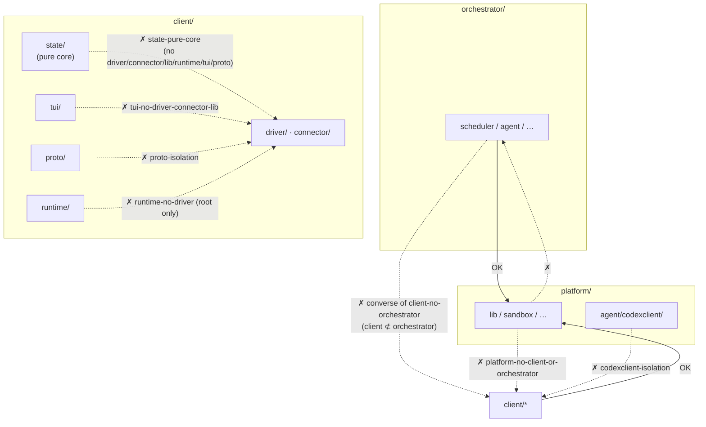

# Code & Architecture Enforcement

The mechanisms that keep the **codebase** true to its intended architecture. Unlike review-dependent conventions, most are rejected mechanically at **lint or compile time**. For each: what it prevents, where it is defined, how it is enforced, and how a developer declares an exception.

The design principles themselves are owned by [ARCHITECTURE.md](../../ARCHITECTURE.md); this document covers their enforcement. (Runtime controls over the autonomous *agents* are a separate concern — see [guardrails.md](guardrails.md).)

## 1. Import boundaries (depguard)

The dependency direction across the three layers (platform / client / orchestrator), and intra-layer subsystem isolation, are enforced by `depguard`. Definitions are in `depguard.rules` of `src/.golangci.yml`; violations are rejected by `make lint`.

| Rule | Scope | Deny (summary) |
|---|---|---|
| `platform-no-client-or-orchestrator` | `platform/**` | `client/`, `orchestrator/` |
| `client-no-orchestrator` | `client/**` | `orchestrator/` |
| `state-pure-core` | `client/state/**` | `driver/`, `connector/`, `platform/lib`, `runtime/`, `tui/`, `proto/` |
| `tui-no-driver-connector-lib` | `client/tui/**` | `driver/`, `connector/`, `platform/lib` |
| `worker-no-driver-connector-lib` | `client/runtime/worker/**` | `driver/`, `connector/`, `platform/lib` |
| `sandbox-tool-agnostic` | `platform/sandbox/**` | `driver/`, `connector/`, `platform/lib`, `runtime/` |
| `proto-isolation` | `client/proto/**` | `driver/`, `connector/`, `platform/lib`, `runtime/`, `tui/` |
| `runtime-no-driver` | `client/runtime/*.go` (root only) | `driver/` |
| `subsystem-isolation` | `client/runtime/subsystem/**` | `tui/`, `connector/` |
| `codexclient-isolation` | `platform/agent/codexclient/**` | `client/`, `orchestrator/` |

Key intents:

- **Layer direction**: platform is the base and knows nothing above it; client does not know orchestrator (the converse is guaranteed by `platform-no-...`).
- **`state/` purity**: the state machine has no I/O and no side effects — a pure functional core. It cannot import driver/runtime/tui at all.
- **`runtime-no-driver`**: only the runtime **root** is forbidden from importing driver. Tool-specific backends move to `runtime/subsystem/<kind>/`. Exception: `client/driver/vt` is explicitly allowed in `exclusions.rules`.
- **`codexclient` reusability**: a shared protocol transport, so it knows nothing of agent-roost internals.

## 2. No mutexes in state/ (forbidigo)

The `forbidigo` linter forbids mutex use in the `client/state` package (`forbidigo.patterns` in `.golangci.yml`), with the message **"state/ is a pure functional core — no mutexes allowed"**. Concurrency control lives outside the reducer (in the runtime layer); state is folded as a value.

## 3. Length limits

| Limit | Value | Enforced by |
|---|---|---|
| Function length | 80 lines (`funlen`, `ignore-comments: true`) | lint (`.golangci.yml`) |
| File length | 500 lines | convention (AGENTS.md); not linted, upheld in review |

`funlen` exceptions (in `exclusions.rules`):

- `_test.go` — tests relax funlen / errcheck.
- `client/state/reduce_*.go` — state-machine dispatch tables stay cohesive as one unit (function-length exempt).

Exceptions are declared **by path pattern in `.golangci.yml`, not by an in-code annotation** — anything matching `reduce_*.go` is exempt automatically. Generated code (`codexschema/v*/types.gen.go`, etc.) is auto-excluded from file/function-length checks too.

## 4. Feature flags

`platform/features/features.go` has **two mechanisms that share no key space**.

| Kind | Mechanism | How to add | Toggle | Stays in the binary? |
|---|---|---|---|---|
| runtime | `Flag` constant + injected `Set` | add a `Flag` constant and list it in `All()` | `~/.roost/settings.toml` `[features.enabled]` | both branches compiled (C `if(){}` equivalent) |
| compile-time | top-level `const` bool guarded by a build tag | create a `//go:build tag` / `!tag` file pair | `go build -tags <tag>` | off-side removed by dead-code elimination (C `#if` equivalent) |

A runtime flag is read as `st.Features.On(features.Peers)` (`features.go:36`). `FromConfig` **silently ignores unknown keys** (`features.go:46`), so deleting a Flag constant never breaks config parsing on existing installations. When a flag stabilises, delete the constant and inline the enabled branch.

## 5. Wire format is stdlib-only (convention)

Wire-format / persistence types are written with **stdlib only (`encoding/json`)** (AGENTS.md / ARCHITECTURE.md). This is a portability constraint, currently **a convention upheld in review rather than linted**. As a worked example, `client/proto/codec.go` uses only `encoding/json`. Do not bring a new codec library (protobuf, etc.) into the wire layer.

## Related

- Canonical design principles: [ARCHITECTURE.md](../../ARCHITECTURE.md)
- Per-layer deep dives: [platform](platform/README.md) · [client](client/README.md) · [orchestrator](orchestrator/README.md)
- Agent-control guardrails (admission, concurrency, capability, autonomy, liveness): [guardrails.md](guardrails.md)
