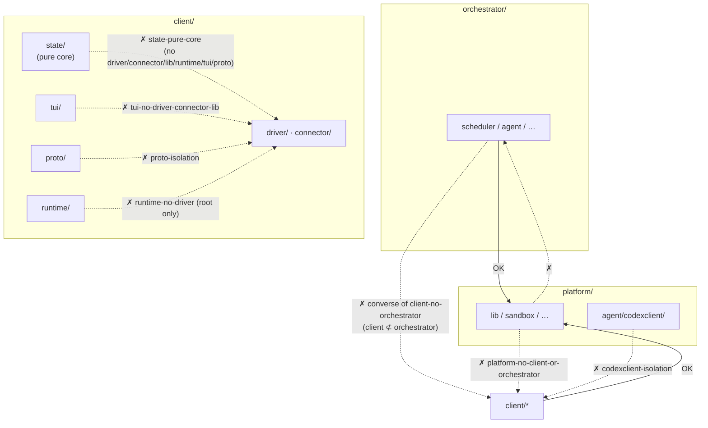
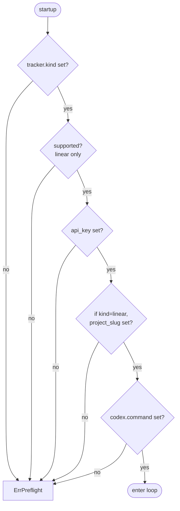

# Guardrails — The Enforcement Mechanisms That Keep the Architecture Honest

A cross-cutting catalogue of the **enforcement mechanisms (guardrails)** that keep this repository true to its intended design. Most are not review-dependent conventions — they are rejected mechanically at **lint, compile, or runtime**. For each, this document states what it prevents, where it is defined, how it is enforced, and how a developer declares an exception.

The design principles themselves are owned by [ARCHITECTURE.md](../../ARCHITECTURE.md); this document covers the enforcement side.

## 1. Import boundaries (depguard)

The dependency direction across the three layers (platform / client / orchestrator), and the intra-layer subsystem isolation, are enforced by `depguard`. Definitions live in `depguard.rules` of `src/.golangci.yml`. Violations are rejected by `make lint` before compilation.



| Rule | Scope | Deny (summary) |
|---|---|---|
| `platform-no-client-or-orchestrator` | `platform/**` | `client/`, `orchestrator/` |
| `client-no-orchestrator` | `client/**` | `orchestrator/` |
| `state-pure-core` | `client/state/**` | `driver/`, `connector/`, `platform/lib`, `runtime/`, `tui/`, `proto/` |
| `tui-no-driver-connector-lib` | `client/tui/**` | `driver/`, `connector/`, `platform/lib` |
| `worker-no-driver-connector-lib` | `client/runtime/worker/**` | `driver/`, `connector/`, `platform/lib` |
| `sandbox-tool-agnostic` | `platform/sandbox/**` | `driver/`, `connector/`, `platform/lib`, `runtime/` |
| `proto-isolation` | `client/proto/**` | `driver/`, `connector/`, `platform/lib`, `runtime/`, `tui/` |
| `runtime-no-driver` | `client/runtime/*.go` (root only) | `driver/` |
| `subsystem-isolation` | `client/runtime/subsystem/**` | `tui/`, `connector/` |
| `codexclient-isolation` | `platform/agent/codexclient/**` | `client/`, `orchestrator/` |

Key intents:

- **Layer direction**: platform is the base layer and knows nothing above it. client does not know orchestrator (and the converse is guaranteed by `platform-no-...`).
- **`state/` purity**: the state machine has no I/O and no side effects — a pure functional core. It cannot import driver/runtime/tui at all.
- **`runtime-no-driver`**: only the runtime **root** is forbidden from importing driver. Tool-specific backends move to `runtime/subsystem/<kind>/`. Exception: `client/driver/vt` is explicitly allowed in `exclusions.rules` (`.golangci.yml`).
- **`codexclient` reusability**: a shared protocol transport, so it knows nothing of agent-roost internals (client/orchestrator).

## 2. No mutexes in state/ (forbidigo)

The `forbidigo` linter forbids mutex use in the `client/state` package (`forbidigo.patterns` in `.golangci.yml`). The message: **"state/ is a pure functional core — no mutexes allowed"**. Concurrency control lives outside the reducer (in the runtime layer); state is folded as a value. This is the mechanical guarantee of that design.

## 3. Length limits

| Limit | Value | Enforced by |
|---|---|---|
| Function length | 80 lines (`funlen`, `ignore-comments: true`) | lint (`.golangci.yml`) |
| File length | 500 lines | convention (AGENTS.md); not linted, upheld in review |

`funlen` exceptions (in `exclusions.rules` of `.golangci.yml`):

- `_test.go` — tests relax funlen / errcheck.
- `client/state/reduce_*.go` — state-machine dispatch tables stay cohesive as one unit (function-length exempt).

Exceptions are declared **by path pattern in `.golangci.yml`, not by an in-code annotation**. Anything matching `reduce_*.go` is exempt automatically, so no per-file annotation is needed. Generated code (`codexschema/v*/types.gen.go`, etc.) is auto-excluded from file/function-length checks too.

## 4. Runtime guardrails (orchestrator scheduler)

The orchestrator is an autonomous pipeline, so it has several runtime gates to avoid launching an agent in an invalid state.

### Preflight — gates the whole run

`scheduler.Preflight` (`orchestrator/scheduler/preflight.go:21`) validates the **runtime-observable fields** of the resolved config and refuses to start the run if any is invalid (distinct from `wfconfig.validate`'s type/range checks).



### Eligibility — narrowing the dispatch set

`eligible` (`eligibility.go:26`, SPEC §8.2) filters candidate issues through several stages. Matching any one of these means the issue is not dispatched.

```mermaid
flowchart LR
    C["candidate issue"] --> F1{ID/Identifier/<br/>Title/State all non-empty?}
    F1 -->|no| X[excluded]
    F1 -->|yes| F2{active and<br/>not terminal?}
    F2 -->|no| X
    F2 -->|yes| F3{running?}
    F3 -->|yes| X
    F3 -->|no| F4{already claimed?}
    F4 -->|yes| X
    F4 -->|no| F5{retry-queued?<br/>(defense-in-depth)}
    F5 -->|yes| X
    F5 -->|no| F6{todo with an<br/>active blocker?}
    F6 -->|yes| X
    F6 -->|no| OK[dispatch candidate]
```

### Slot allocation — concurrency caps

`availableGlobalSlots` / `availablePerStateSlots` (`slots.go`, SPEC §8.3) cap the number of concurrent agents. RetryQueued issues are claimed, so they occupy a slot during the backoff window too. A state with no per-state cap (`MaxConcurrentAgentsByState`) falls back to the global cap (`MaxConcurrentAgents`).

### Claim state machine — single authority

Each issue's claim state (`scheduler/state.go`, SPEC §7.1) prevents double slot allocation and loss of retry intent. The state diagram is in the [orchestrator README](orchestrator/README.md#scheduler-state-machine).

## 5. Security guardrails

The boundaries that limit an in-container agent's privileges. The implementation is in [brokers.md](platform/brokers.md); the security model is owned by [sandbox.md](platform/sandbox.md).

| Mechanism | Prevents | Enforced by |
|---|---|---|
| hostexec allowlist | arbitrary host command execution | `Policy.Check` (deny-first, default-deny) |
| mcpproxy tool policy | disallowed MCP tool calls | `Policy.CheckTool` (gates tools/call) |
| credproxy token | credential leakage across projects | per-project 256-bit token ↔ projectID verification |
| devcontainer isolation | direct host access | container boundary + brokered stdio |
| argv-direct exec | shell injection | `Spawn` interposes no `/bin/sh -c` ([spawn-and-launch.md](platform/spawn-and-launch.md)) |

## 6. Feature flags

`platform/features/features.go` has **two mechanisms that share no key space**.

| Kind | Mechanism | How to add | Toggle | Stays in the binary? |
|---|---|---|---|---|
| runtime | `Flag` constant + injected `Set` | add a `Flag` constant and list it in `All()` | `~/.roost/settings.toml` `[features.enabled]` | both branches compiled (C `if(){}` equivalent) |
| compile-time | top-level `const` bool guarded by a build tag | create a `//go:build tag` / `!tag` file pair | `go build -tags <tag>` | off-side removed by dead-code elimination (C `#if` equivalent) |

A runtime flag is read as `st.Features.On(features.Peers)` (`features.go:36`). `FromConfig` **silently ignores unknown keys** (`features.go:46`), so deleting a Flag constant never breaks config parsing on existing installations. When a flag stabilises, delete the constant and inline the enabled branch.

## 7. Wire format is stdlib-only (convention)

Wire-format / persistence types are written with **stdlib only (`encoding/json`)** (AGENTS.md / ARCHITECTURE.md). This is a portability constraint, currently **a convention upheld in review rather than linted**. As a worked example, `client/proto/codec.go` uses only `encoding/json`. Do not bring a new codec library (protobuf, etc.) into the wire layer.

## Related

- Canonical design principles: [ARCHITECTURE.md](../../ARCHITECTURE.md)
- Per-layer deep dives: [platform](platform/README.md) · [client](client/README.md) · [orchestrator](orchestrator/README.md)
- Testing strategy and coverage targets: [docs/agent/testing.md](../agent/testing.md)
