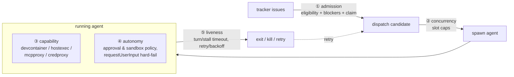
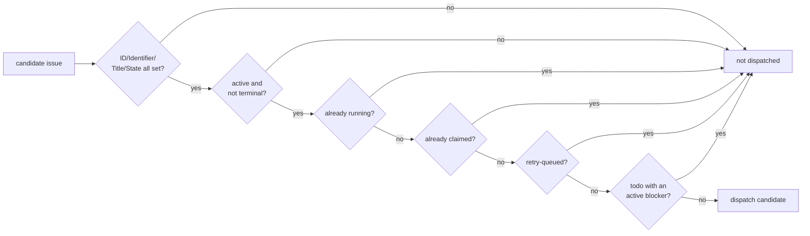

# Guardrails — Controlling Autonomous Agents

The orchestrator runs coding agents **unattended** against an issue tracker. Guardrails are the mechanisms that keep those agents inside safe, intended bounds without a human in the loop. They answer five questions:

1. **Admission** — which issues does an agent get dispatched onto?
2. **Concurrency** — how many agents run at once?
3. **Capability** — what can a running agent touch?
4. **Autonomy** — what may an agent do without asking a human?
5. **Liveness** — how long may an agent run, and how are failures bounded?

> This document is about controlling **agents**. The separate concern of keeping the **codebase** true to its architecture (depguard import rules, function-length limits, etc.) is in [code-enforcement.md](code-enforcement.md).

All knobs live in `WORKFLOW.md` front matter and are resolved by `orchestrator/wfconfig/`; user-facing configuration is in the [orchestrator user guide](../user/orchestrator.md).

## 1. Admission control — which issues get an agent

`eligible` (`orchestrator/scheduler/eligibility.go:26`, SPEC §8.2) decides whether a tracker issue may be dispatched. An agent is **never** started for an issue that fails any stage:

- **Active-state gate**: only issues in a configured active state (and not terminal) are worked. An issue that leaves the active set mid-run is killed on the next reconcile (see §5).
- **Blocker gating**: a `todo` issue with any blocker not yet in a terminal state is held back (`hasActiveBlocker`), so agents never start work whose dependencies are unmet.
- **Single authority (claim)**: the claim state (`scheduler/state.go`, SPEC §7.1) guarantees **at most one agent per issue** — `running` and `claimed` issues are excluded, preventing two agents racing on the same work.

## 2. Concurrency control — how many agents run

Caps on simultaneous agents prevent resource exhaustion and runaway fan-out (`orchestrator/scheduler/slots.go`, SPEC §8.3):

| Knob (`WORKFLOW.md`) | Default | Effect |
|---|---|---|
| `agent.max_concurrent_agents` | 10 | global cap on running + retry-queued agents |
| `agent.max_concurrent_agents_by_state` | — | per-state cap; falls back to the global cap when a state is unlisted |

RetryQueued issues are claimed, so they **occupy a slot during the backoff window** (`retryQueuedCount`) — a failing issue cannot be re-dispatched in a way that exceeds the cap.

## 3. Capability sandboxing — what a running agent can touch

A dispatched agent runs inside a per-project devcontainer and can only reach the host through brokers that enforce policy. This is the hard security boundary. Implementation is in [brokers.md](platform/brokers.md); the security model rationale is in [sandbox.md](platform/sandbox.md).

| Guardrail | What it limits | Enforced by |
|---|---|---|
| devcontainer isolation | direct host access | container boundary; the agent only sees brokered stdio / short-lived tokens |
| hostexec allowlist | which host binaries the agent may run | `Policy.Check` — deny-first, default-deny glob patterns |
| mcpproxy tool policy | which MCP tools the agent may call | `Policy.CheckTool` — gates `tools/call` and filters `tools/list` |
| credproxy scoped tokens | cross-project credential access | per-project 256-bit token ↔ projectID |
| argv-direct exec | shell-metacharacter injection | `agentlaunch.Spawn` interposes no `/bin/sh -c` ([spawn-and-launch.md](platform/spawn-and-launch.md)) |

## 4. Autonomy policy — what an agent may do without a human

Because the orchestrator runs unattended, the **approval and sandbox policy** decides how much an agent may do on its own. These are passed to the agent at `thread/start` / `turn/start` via `codexclient.ThreadOptions` / `TurnOptions` (`platform/agent/codexclient/client.go`):

| Knob (`WORKFLOW.md` `codex.*`) | Meaning |
|---|---|
| `approval_policy` | when the agent must request approval before acting (e.g. `never`, `on-request`) |
| `thread_sandbox` | thread-level sandbox mode (e.g. `workspace-write`, `danger-full-access`) |
| `turn_sandbox_policy` | per-turn sandbox policy override |

How approval requests are resolved (`orchestrator/agent/handler.go:OnServerRequest`):

- **Command / file-change approval** → the orchestrator auto-replies `acceptForSession` (`handler.go:170`). It runs unattended, so it cannot interactively prompt; the real containment is the capability sandbox in §3, not an approval dialog.
- **`item/tool/requestUserInput`** → **hard-fails the turn** (`handler.go:181`, SPEC §10.5). Automated orchestration cannot supply user input, so an agent that asks for it is stopped rather than left hanging.

This is the key posture: the orchestrator does not pretend to be a human approver. It auto-accepts in-sandbox actions (bounded by §3) and refuses anything that genuinely needs a person.

## 5. Liveness & failure bounds — how long an agent runs

Reconcile (`scheduler`, SPEC §7/§16) bounds how long an agent may run and how failures are retried, so a stuck or runaway agent cannot hold a slot forever.

| Knob (`WORKFLOW.md` `codex.*`) | Default | Bounds |
|---|---|---|
| `turn_timeout_ms` | 3,600,000 (1 h) | max wall-time for a single turn |
| `stall_timeout_ms` | 300,000 (5 min) | max silence before a turn is considered stalled |
| `read_timeout_ms` | 5,000 | stdio read timeout |
| `agent.max_retry_backoff_ms` | 300,000 (5 min) | ceiling on exponential retry backoff |

- **Stall / turn-timeout kill** (reconcile Part A): a running attempt past its timeout is killed → `WorkerExitAbnormal` → retry enqueued.
- **Tracker refresh** (reconcile Part B): an issue that left its active state is killed or continued accordingly — so closing/reassigning an issue stops its agent.
- **Retry / backoff** (`retry.go`): a normal exit enqueues a fixed **continuation** retry (`continuationDelay = 1s`); an abnormal exit / timeout enqueues an **exponential backoff** retry, `10_000 × 2^(attempt-1)` ms capped at `max_retry_backoff_ms` (SPEC §8.4). Backoff grows with each attempt, so a persistently failing issue self-throttles instead of hot-looping.
- **Claim lifecycle**: every attempt moves through the claim state machine and is `Released` terminally; the diagram is in the [orchestrator README](orchestrator/README.md#scheduler-state-machine).

## 6. Behavioral steering & pre-run validation

- **Driving prompt**: what the agent is actually told to do comes from the `WORKFLOW.md` body, rendered per-issue by `orchestrator/prompt/`. Authoring guidance is in [WORKFLOW.md authoring](../agent/workflow-authoring.md). This is the first-order guardrail — it scopes the agent's task.
- **Preflight**: before *any* agent is dispatched, `scheduler.Preflight` (`orchestrator/scheduler/preflight.go:21`) validates the run is operable (`tracker.kind` supported, `api_key` / `project_slug` present, `codex.command` set). Invalid config gates the whole run, so a misconfigured orchestrator never launches agents at all.

## Config quick reference

| `WORKFLOW.md` key | Guardrail | Section |
|---|---|---|
| `tracker.active_states` / `terminal_states` | admission (active-state gate) | §1 |
| `agent.max_concurrent_agents` / `..._by_state` | concurrency caps | §2 |
| `host_exec` / `mcp` allow-deny (sandbox) | capability allowlists | §3 |
| `codex.approval_policy` / `thread_sandbox` / `turn_sandbox_policy` | autonomy policy | §4 |
| `codex.turn_timeout_ms` / `stall_timeout_ms` / `read_timeout_ms` | liveness timeouts | §5 |
| `agent.max_retry_backoff_ms` | retry backoff ceiling | §5 |
| `WORKFLOW.md` body | driving prompt | §6 |

## Related

- Broker implementation (capability enforcement): [brokers.md](platform/brokers.md) · security model: [sandbox.md](platform/sandbox.md)
- Agent protocol (approval/sandbox options, turn sequence): [agent-protocol.md](platform/agent-protocol.md)
- Orchestrator pipeline & state machines: [orchestrator README](orchestrator/README.md)
- Code/architecture enforcement (depguard, length limits, feature flags): [code-enforcement.md](code-enforcement.md)
