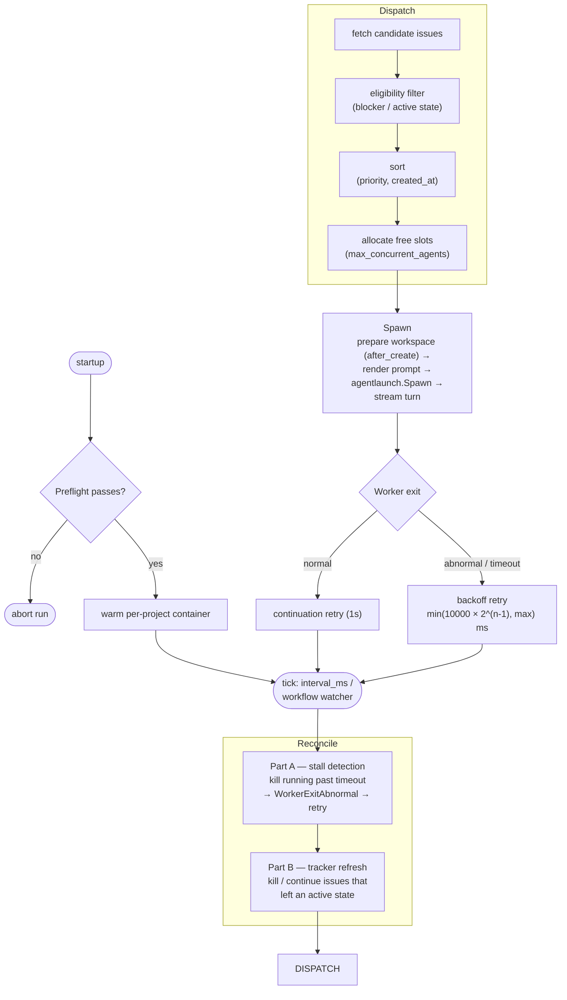
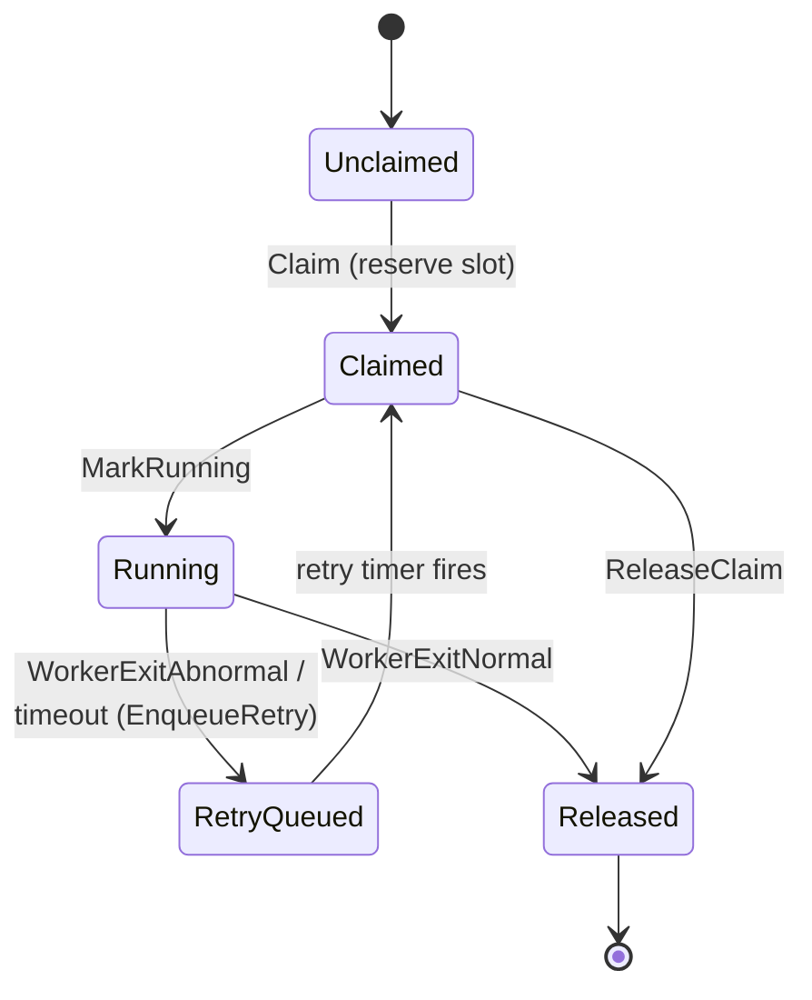
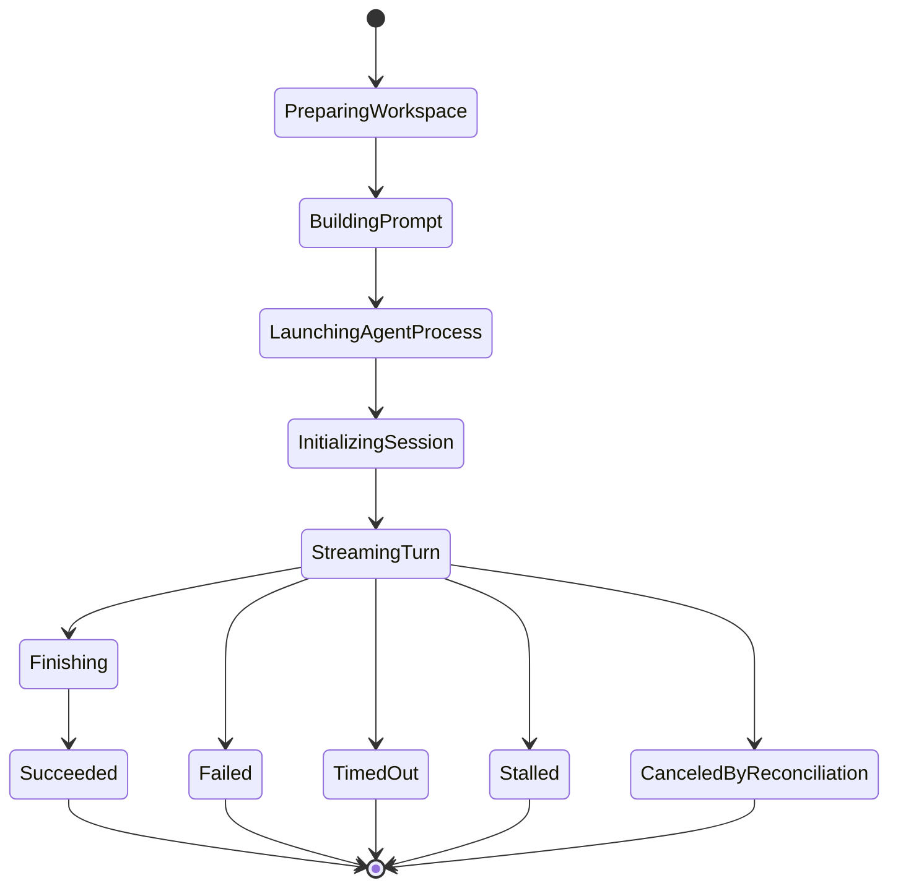

# orchestrator/ — Symphony SPEC Implementation

The orchestrator is a **TUI-less**, **single-authority** background service that implements the [Symphony SPEC](https://github.com/openai/symphony/blob/main/SPEC.md). It polls a Linear tracker, dispatches coding agents to per-issue workspaces, reconciles running/stalled sessions, and exposes a read-only observability HTTP server (§13.7 — mandatory in our implementation).

It lives entirely inside `orchestrator/`, does **not** import `client/`, and shares `platform/` (logger, metrics, tracker/linear, agent/codexclient, agentlaunch, lib/codex, sandbox) with roost. The boundary is enforced by the `depguard` rule `client-no-orchestrator` and its converse.

User-facing operation (running it, the `WORKFLOW.md` config, agent selection) is in the [orchestrator user guide](../../user/orchestrator.md). Authoring the driving prompt is in [WORKFLOW.md authoring](../../agent/workflow-authoring.md).

## Packages

| Package | SPEC | Responsibility |
|---|---|---|
| `orchestrator/workflowfile/` | §5 | `WORKFLOW.md` YAML front matter + body loader |
| `orchestrator/wfconfig/` | §6 | Config resolution, defaults, `$VAR` expansion |
| `orchestrator/scheduler/` | §7 §8 §16 | Poll loop, dispatch, retry/backoff, reconcile |
| `orchestrator/tracker/` | §3.1.3 | Tracker adapter wrapper (→ `platform/tracker/linear/`) |
| `orchestrator/workspace/` | §9 | Per-issue workspace directory + lifecycle hooks |
| `orchestrator/agent/` | §10 | Agent runner + event handler |
| `orchestrator/prompt/` | §12 | Liquid-compatible prompt template renderer |
| `orchestrator/httpserver/` | §13.7 | Observability HTTP — `/api/v1/state`, `/api/v1/refresh` |
| `orchestrator/lineargql/` | §10.5 | `linear_graphql` client-side tool handler (advertise blocked) |

Full SPEC component ↔ package correspondence and the documented deviation posture: [symphony-conformance.md](symphony-conformance.md).

## The poll / dispatch / reconcile pipeline

On startup `cmd/orchestrator` loads the workflow, resolves config, runs a **preflight** check (`scheduler.Preflight` — invalid config gates the whole run; see [guardrails](../guardrails.md#4-runtime-guardrails-orchestrator-scheduler)), warms the per-project container, then enters the loop. Each tick (`polling.interval_ms`, or a filesystem watcher on the workflow):

1. **Reconcile (Part A — stall detection):** running attempts that exceeded their stall/turn timeout are killed → `WorkerExitAbnormal` → retry enqueued.
2. **Reconcile (Part B — tracker refresh):** re-fetch tracker state; issues that left an active state are killed or continued accordingly.
3. **Dispatch:** fetch candidate issues → filter by eligibility (blockers, active state) → sort (priority, creation time) → allocate free slots (`agent.max_concurrent_agents`) → spawn.
4. **Spawn:** prepare the per-issue workspace (running `after_create` hooks), render the prompt, launch the agent via `agentlaunch.Spawn` (argv-direct, no host shell; `codex.command` is tokenized by `SplitArgs` then wrapped by `Dispatcher` — see [spawn-and-launch](../platform/spawn-and-launch.md)), and stream the turn.
5. **Worker exit:** normal exit enqueues a *continuation* retry (fixed 1s); abnormal exit / timeout enqueues a *backoff* retry (`min(10000 × 2^(n-1), max)` ms).

The observability HTTP server (when enabled) reads the same scheduler snapshot.

## Scheduler state machine

Each issue moves through a **claim state** (`scheduler/state.go`, SPEC §7.1):

| ClaimState | Meaning |
|---|---|
| `Unclaimed` | Initial — no slot reserved |
| `Claimed` | Reserved but not yet running |
| `Running` | Worker active |
| `RetryQueued` | Waiting for the retry timer |
| `Released` | Removed from all tracking (terminal) |

A single run attempt has an 11-phase **run phase** lifecycle (SPEC §7.2):

Transition functions live in `scheduler/state_transitions.go` (`Claim`, `MarkRunning`, `WorkerExitNormal`, `WorkerExitAbnormal`, `EnqueueRetry`, `ReleaseClaim`); retry/backoff in `retry.go`; eligibility rules in `eligibility.go`; slot allocation in `slots.go`.

## Agent protocol

The `agent.command` (Codex `app-server` or `claude-app-server`) is driven over the Codex app-server stdio protocol. The runner tokenizes the command string via `agentlaunch.SplitArgs`, wraps via `Dispatcher.Wrap`, and spawns via `agentlaunch.Spawn` (argv stdio; no host-side shell). Both emit the same event sequence — `thread/started → turn/started → item/* → thread/tokenUsage/updated → turn/completed` — so the scheduler is agent-agnostic. The `claude-app-server` shim wraps a Claude agent as a drop-in app-server; approval/sandbox policy hints are logged but not enforced (isolation is provided by the devcontainer, see [sandbox.md](../platform/sandbox.md)).

The protocol layer itself — `codexclient` framing, the `codexschema` v1/v2 type split, the full turn sequence diagram, and how the `claude-app-server` shim translates Claude CLI stream-json into Codex notifications — is documented in [agent-protocol.md](../platform/agent-protocol.md). The launch primitives (`SplitArgs`/`Dispatcher`/`Spawn`/`procgroup`) are in [spawn-and-launch.md](../platform/spawn-and-launch.md).

## Conformance

[symphony-conformance.md](symphony-conformance.md) is the source of truth for the SPEC §17 ↔ test correspondence table, the strictly-honored items, and the documented deviations/extensions (e.g. mandatory HTTP server, multi-agent via `codex.command`, the `linear_graphql` advertise block).
