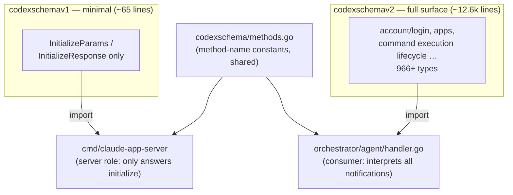
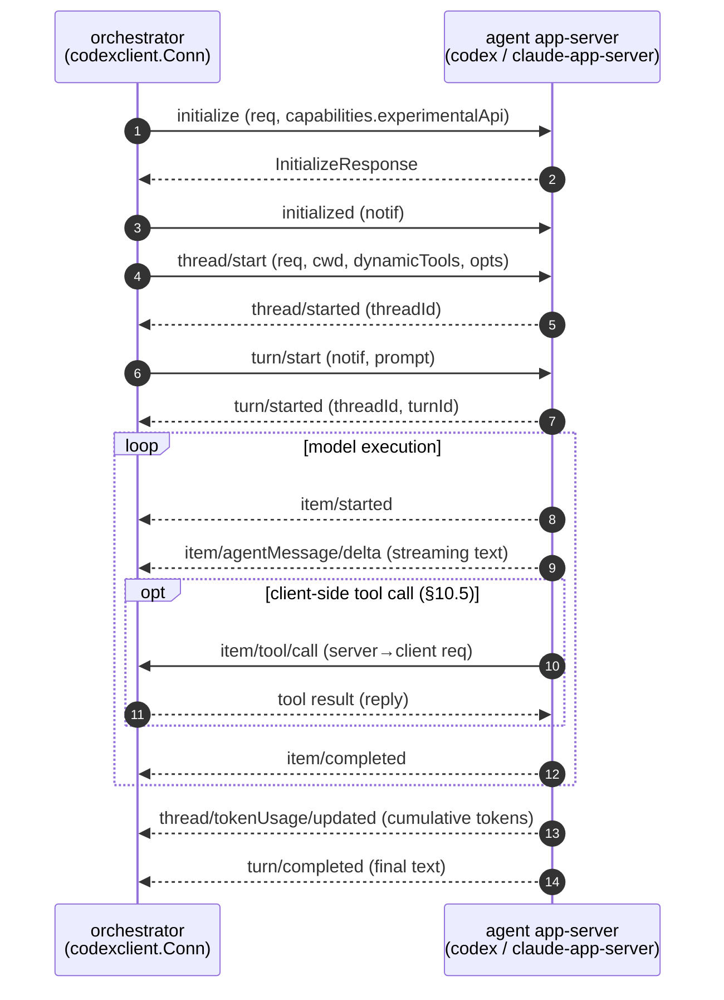
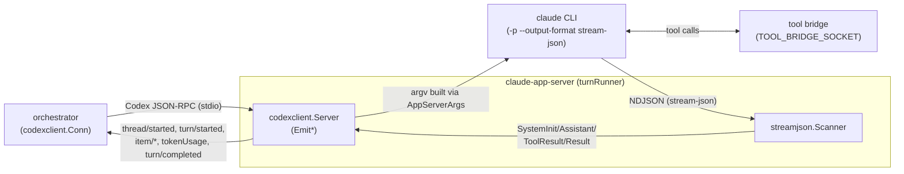

# Agent Protocol — The Codex app-server Protocol Layer

The shared **stdio JSON-RPC protocol** the orchestrator uses to drive an agent (Codex / Claude). This layer is what lets the scheduler stay **agent-agnostic** — Codex and Claude emit the same event sequence, so nothing above has to branch on the agent.

| Package | Responsibility |
|---|---|
| `platform/agent/codexclient/` | Transport-agnostic JSON-RPC framing; helpers for both the client and server roles |
| `platform/agent/codexschema/` | Protocol method-name constants + generated types (v1/v2), pinned to a JSON Schema |
| `platform/lib/codex/` | argv builders for launching the codex process |
| `platform/lib/claude/` | Claude CLI integration (`cli/` argv builders, `streamjson/` output parser) |

The launch path (how it becomes a process) is in [spawn-and-launch.md](spawn-and-launch.md); the scheduler-side usage is in the [orchestrator README](../orchestrator/README.md).

## codexclient — JSON-RPC framing

`Conn` (`codexclient/conn.go:33`) is the hub that routes JSON-RPC messages.

- `Request(method, params)` (`conn.go:83`) — a client→server request that awaits a response
- `Notify(method, params)` (`conn.go:111`) — a notification, no response expected
- `Run(ctx, Handler)` (`conn.go:56`) — the receive loop; dispatches to the `Handler`'s `OnNotification` / `OnServerRequest` (`conn.go:23-27`)

**Client-role** helpers (`client.go`): `Initialize` performs the `initialize` request + `initialized` notification handshake and sends `capabilities: {experimentalApi: true}` (`client.go:11`). `StartThread` (advertises the `§10.5` dynamicTools), `StartTurn`, and `ResumeThread` build their respective requests.

**Server-role** helpers (`server.go`): `Server` provides notification emitters — `EmitThreadStarted` / `EmitTurnStarted` / `EmitTurnCompleted` / `EmitAgentMessageDelta` / `EmitItemStarted` / `EmitItemCompleted` / `EmitTokenUsage` (`server.go:25-85`). The `claude-app-server` shim uses these to "speak" the Codex protocol.

There are two transports: stdio (`transport_stdio.go`) and websocket (`transport_ws.go`).

## codexschema — method constants and versioned types

`methods.go` (package `codexschema`) holds the protocol method names in four groups:

| Group | Examples |
|---|---|
| client→server requests | `initialize` / `thread/start` / `thread/resume` |
| client→server notifications | `initialized` / `turn/start` |
| server→client notifications | `thread/started` / `turn/started` / `item/started` / `item/agentMessage/delta` / `item/completed` / `thread/tokenUsage/updated` / `turn/completed` / `error` … |
| server→client requests | `item/commandExecution/requestApproval` / `item/fileChange/requestApproval` / `item/tool/call` (§10.5) / `item/tool/requestUserInput` (experimental) |

> Documented posture for `item/tool/requestUserInput`: automated orchestration treats it as a hard fail (`methods.go:47`).

Types are generated from JSON Schema by quicktype into `v1/types.gen.go` (package `codexschemav1`) and `v2/types.gen.go` (package `codexschemav2`). These are **pinned** to a specific codex-cli version and verified by a CI drift check (`make codex-schema-check`) that diffs the committed bundles against current codex output. A schema bump requires an explicit PR that updates the pin and regenerates types (details in `platform/agent/codexschema/README.md`). The generated files are auto-excluded from the lint file/function-length checks.

### v1 / v2 — selected at import time

The two differ only in type coverage; **there is no runtime negotiation**. `initialize` sends `experimentalApi: true`, but which type set is used is decided by the **consumer's import choice**.

- `claude-app-server` only returns `initializeResponse()`, so the minimal **v1** suffices (`cmd/claude-app-server/main.go:12`).
- The orchestrator's `turnHandler` interprets `thread/started`, `turn/completed`, `tokenUsage`, etc., so it imports **v2** plus the shared `codexschema` constants (`orchestrator/agent/handler.go:13-14`).

## The agent turn sequence

The orchestrator's `agent/runner.go:launchConn` opens a `Conn`, and the `turnHandler` (`handler.go`) receives notifications.

`turnHandler.OnNotification` (`handler.go:67`) signals `sessionReady` on `turn/started` and `turnDone` on `turn/completed`, measures the turn duration, and reports a `CodexActivity` to metrics. It auto-replies `acceptForSession` to `item/*/requestApproval` (`handler.go:170`).

## Presenting Claude as the Codex protocol — the claude-app-server shim

Claude has no native app-server, so `cmd/claude-app-server` acts as a **drop-in shim** that speaks the Codex protocol while internally launching the Claude CLI and translating its stream-json output.

- `cli/argv.go`'s `AppServerArgs(resumeSessionID, appendSystemPrompt, prompt)` (`:29`) builds argv like `-p --output-format stream-json --verbose --resume <id>`. `SandboxFlags` (`:15`) adds sandbox flags.
- `streamjson` (`streamjson.go`) parses the CLI's NDJSON into typed events (`SystemInit` / `AssistantMessage` / `ToolResult` / `ToolResults` / `Result` / `Unknown`). `Usage.Total()` returns the token total.
- `turnRunner.scanStream` (`turn.go:170`) translates events into Codex notifications: `SystemInit` → record sessionID, `AssistantMessage` → `EmitAgentMessageDelta`, `ToolResult` → `item/completed`, `Result` → `completeTurn` (which emits `EmitTokenUsage` + `turn/completed`).
- Claude's tool execution is forwarded to an in-band tool bridge over `TOOL_BRIDGE_SOCKET` (`turn.go:99`).

approval / sandbox policy hints are logged but not enforced by the shim — isolation is provided by the devcontainer (see [sandbox.md](sandbox.md)).

## lib/codex — argv builders for codex

`lib/codex/argv.go` builds the process-launch argv:

| Function | Purpose |
|---|---|
| `ParseCommand(argv []string)` (`:26`) | Parse `codex.command` into a `CommandConfig` |
| `AppServerListenArgs(serverBin, sock, extra, sandboxExternal)` (`:54`) | listen-socket mode |
| `AppServerStdioArgs(extra, sandboxExternal)` (`:64`) | stdio mode |
| `RemoteAttachArgs(sock, threadID, startDir)` (`:79`) | remote attach over the app-server UDS (`--remote unix://<sock>`) |
| `ShellJoinArgv(args)` (`:93`) | shell-join argv for a pty pane |

`ShellJoinArgv` is what populates the `Command` form (pty pane) in [spawn-and-launch.md](spawn-and-launch.md).
