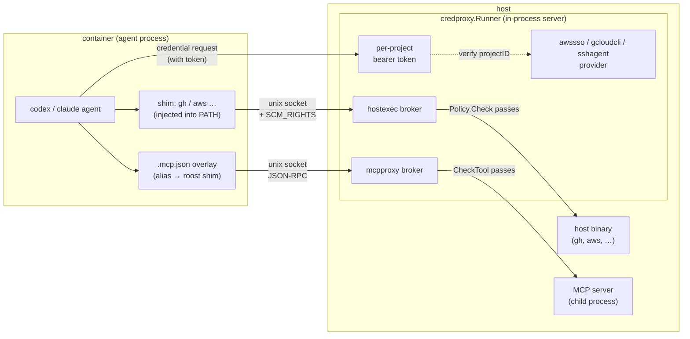
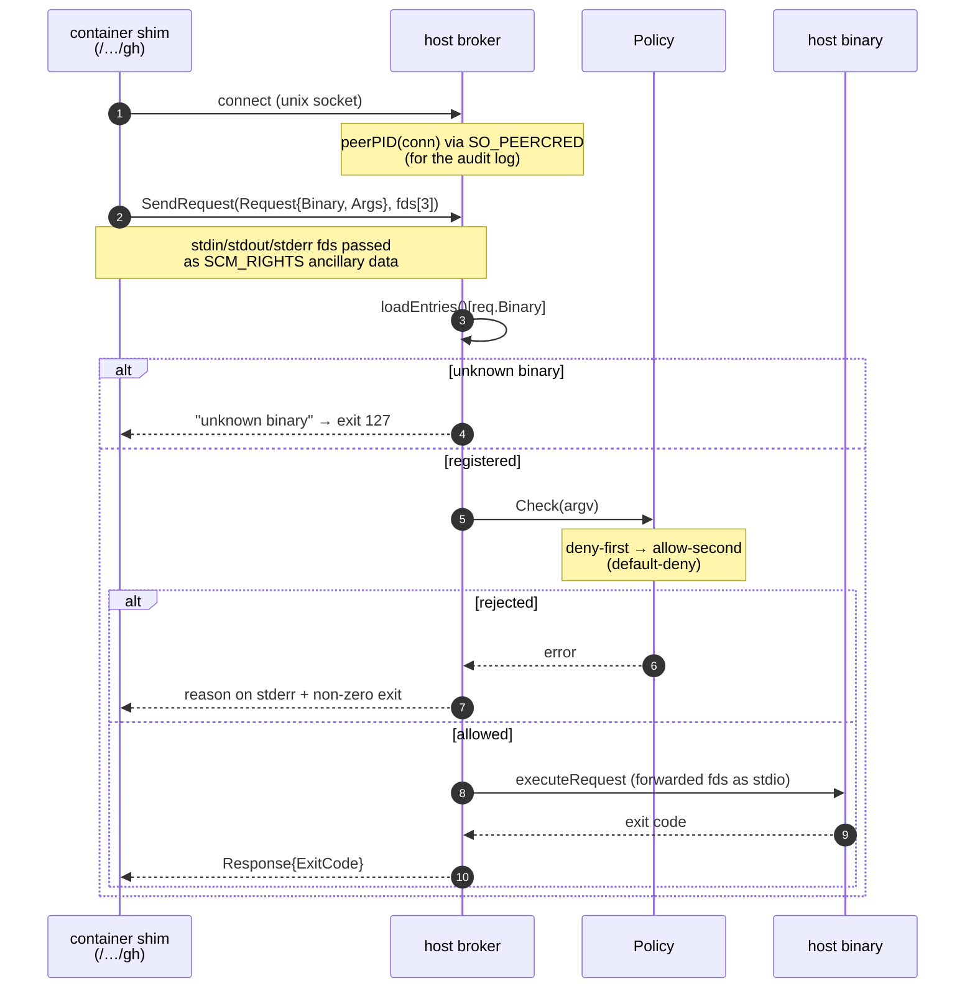
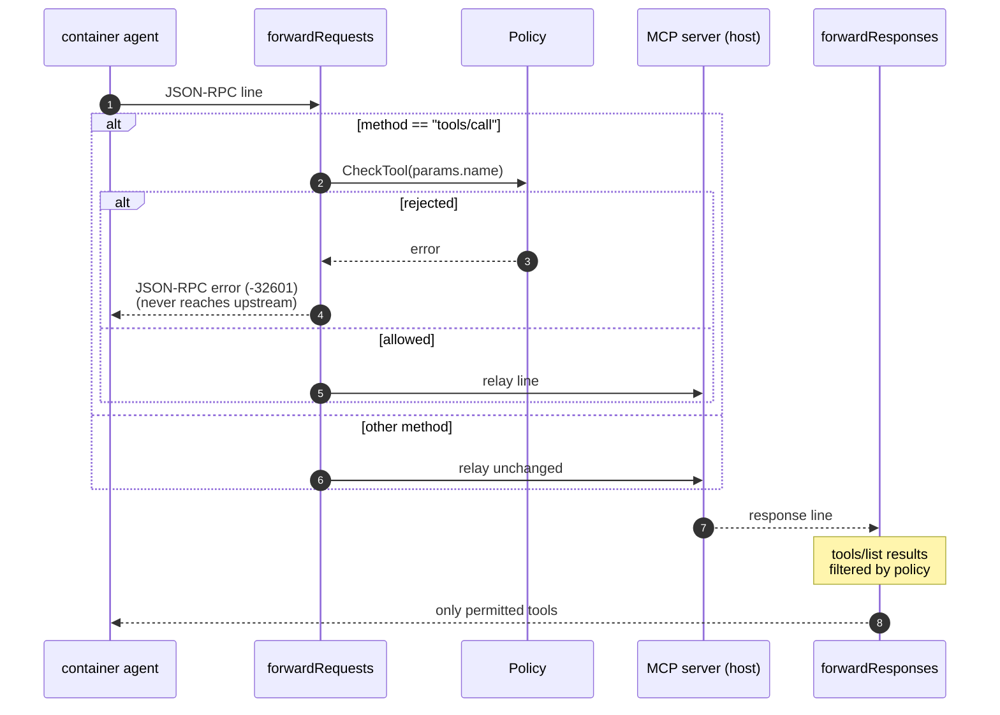

# Brokers — Host Mediation and Policy Enforcement

Implementation deep dive of the three brokers that give an in-container agent **limited** access to host privileges, credentials, and MCP servers.

> This document covers the **"how"** (the implementation). The **"why"** — why this shape is a security boundary (long-lived secrets stay on the host; the container only ever sees short-lived tokens and brokered stdio) — is owned by [sandbox.md → Credential Proxy / Host-exec broker / MCP proxy](sandbox.md#credential-proxy). The two cross-link and avoid duplicating content.

| Package | Role | Enforcement |
|---|---|---|
| `platform/credproxy/` | In-process credential server. Bundles providers and issues a per-project bearer token | token ↔ projectID verification |
| `platform/hostexec/` | Runs allowlisted host binaries on behalf of the container (SCM_RIGHTS stdio forwarding) | deny-first allowlist (`Policy.Check`) |
| `platform/mcpproxy/` | Runs MCP servers on the host and relays JSON-RPC stdio | per-tool policy (`Policy.CheckTool`) |

## The big picture: credproxy bundles the providers

Both hostexec and mcpproxy implement the external `credproxy/container` `container.Provider` interface and register with the `credproxy.Runner` (`credproxy/credproxy.go:83`, `buildProviders`). This collapses credentials, host-exec, and MCP behind a single per-project Unix-socket server.

## credproxy — per-project tokens and provider fan-out

`Runner` (`credproxy.go:36`) holds a `credproxylib.Server` and the provider set. `Start` (`credproxy.go:72`) brings up the server and `buildProviders` registers the awssso / gcloudcli / sshagent providers plus the hostexec and mcpproxy `SpecBuilder`s. The server runs on a child context so `Shutdown` deterministically reaps provider-managed processes such as ssh-agent.

**Token scoping** (`ProjectToken`, `credproxy.go:53`):

- Each project gets a 32-byte (256-bit) token from `crypto/rand` (`generateToken`, `credproxy.go:231`).
- `srv.AddAuthToken(token, projectID)` registers it, where `projectID = container.ProjectRunHash(projectPath)`.
- Repeat requests for the same project reuse the cached token (`tokens map[string]string`).

Container-side requests present this token, and the server matches token → projectID. **This is the boundary that blocks credential leakage across projects.**

## hostexec — proxied execution over SCM_RIGHTS

A container-side shim asks over a Unix socket to "run this binary with this argv"; the broker executes it on the host and returns the exit code. stdio is passed as **the actual file descriptors** via SCM_RIGHTS.

**Policy** (`hostexec/policy.go`) evaluates deny → allow and rejects anything matching neither (default-deny, `Check` `policy.go:77`).

- Patterns are globs (`*` matches any string, including spaces). In `"gh pr *"` the space before `*` is **literal**, so it does not match `"gh preview"` (`CompilePolicy` `policy.go:49`).
- argv is reconstructed into a string by `shellJoin` before matching. This is **to align with Claude Code's Bash permission pattern semantics**; tokens that are not `isShellSafe` get single-quoted (`policy.go:95`).
- Leading `KEY=VALUE` env-assignment tokens are stripped by `trimEnvPrefix` before comparison, so `"ENV=x gh pr *"` and `"gh pr *"` are treated identically.

For audit, the caller PID is read via `SO_PEERCRED` (`peerPID`, `broker.go:81`) and logged together with `/proc/<pid>/comm` (`procComm`).

## mcpproxy — JSON-RPC relay and tool gating

MCP servers run as host-side child processes, with newline-delimited JSON-RPC 2.0 relayed bidirectionally between them and the container. `SpecBuilder` (`mcpproxy/provider.go:21`) is also a `container.Provider`.

- `forwardRequests` (`relay.go:54`) intercepts `tools/call` and gates it with `policy.CheckTool(name)` (`policy.go:43`, deny-first). A rejected call is answered directly to the container with an error and never forwarded upstream.
- `forwardResponses` (`relay.go:86`) filters `tools/list` results by policy so disallowed tools are never shown to the container.
- `ContainerSpec` (`provider.go:61`) takes the project's `.mcp.json` as a base and generates an overlay pointing each alias at the roost shim (`writeMCPJSON`), then returns two bind mounts (broker socket + `.mcp.json` overlay) plus the `ROOST_MCP_SOCK` env. With no servers configured it returns an empty Spec.

## Related documentation

- The full security model and sandbox lifecycle: [sandbox.md](sandbox.md)
- Where brokers are injected into the container along the launch path: [spawn-and-launch.md](spawn-and-launch.md) (`DevcontainerLauncher`)
- Cross-cutting enforcement catalogue: [guardrails.md](../guardrails.md)
