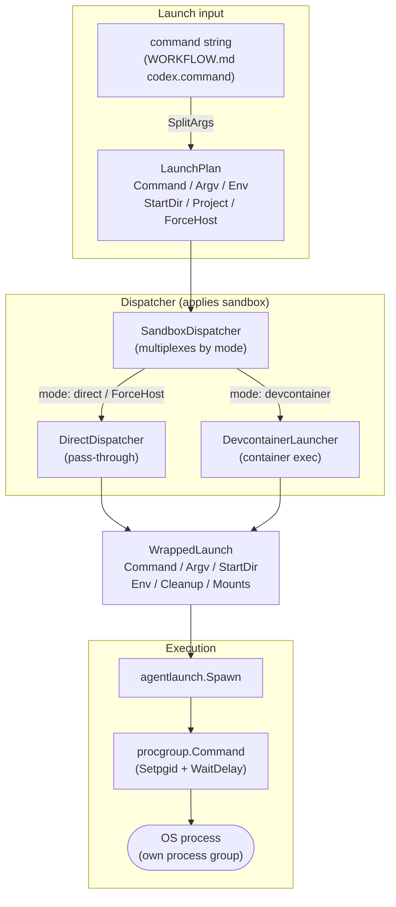
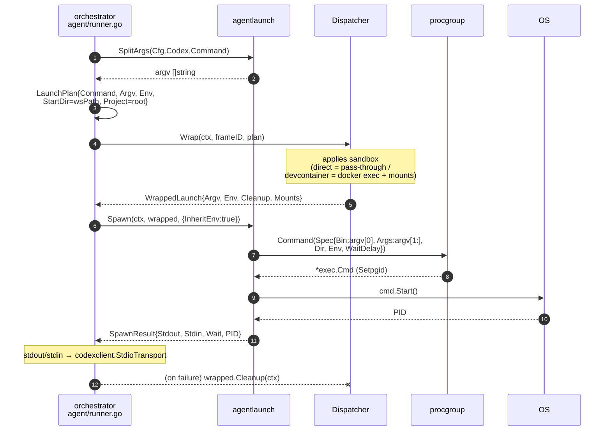
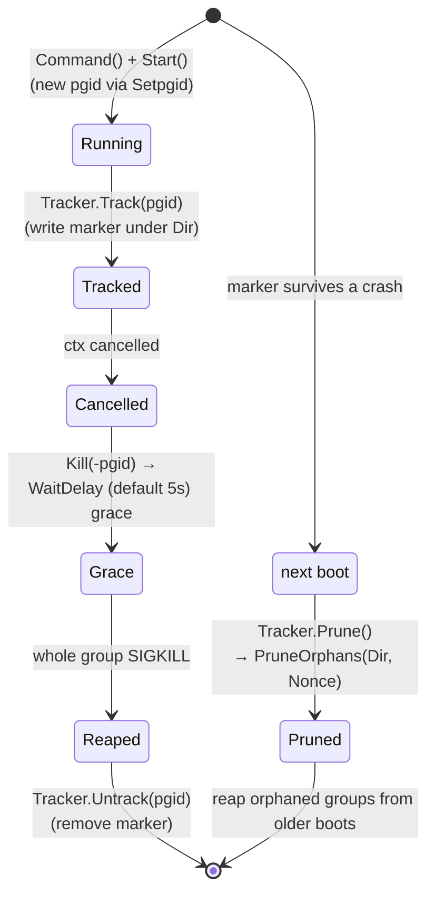

# Spawn & Launch — Centralized Agent Process Launching

The `platform/` layer owns the single answer to **"how does a command string become a running process?"**. Centralized out of `client/` and `orchestrator/` by the recent "platform spawn/command centralization" work, three packages cooperate here.

| Package | Responsibility |
|---|---|
| `platform/agentlaunch/` | Launch specs (`LaunchPlan`/`WrappedLaunch`), sandbox application (`Dispatcher`), argv-direct exec (`Spawn`), POSIX tokenizer (`SplitArgs`) |
| `platform/procgroup/` | Process-group lifecycle (`Command`), orphan reaping (`Tracker`) |
| `platform/pathmap/` | container↔host path translation (`Mounts`) |

User-facing sandbox configuration is in the [sandbox setup guide](../../user/sandbox.md); the in-container broker implementation is in [brokers.md](brokers.md); the agent protocol spoken over the spawned stdio is in [agent-protocol.md](agent-protocol.md).

## Core design: two launch forms and shell-less exec

A launch spec carries **two forms at once** (`agentlaunch/types.go`).

- `Command string` — a shell-joined string. Used by the **tmux pane** launcher (roost).
- `Argv []string` — pre-tokenized argv. Used by **argv-direct exec** (orchestrator). Because **no `/bin/sh -c` is interposed on the host**, shell-metacharacter injection cannot occur by construction.

Per-agent lib builders (`lib/codex`, `lib/claude/cli` — see [agent-protocol.md](agent-protocol.md)) populate both; the caller chooses which to use.

## Types and relationships

### `LaunchPlan` → `WrappedLaunch`

`LaunchPlan` carries pure launch parameters (`types.go:11`). `ForceHost` replaces the client/state `SandboxOverride == SandboxOverrideHost` sentinel, forcing a bypass of the container.

`Dispatcher.Wrap` (`dispatcher.go:8`) applies sandbox logic and returns a `WrappedLaunch` (`types.go:32`), which includes the teardown hook `Cleanup func(context.Context) error` and the `Mounts []Mount` used for in-container path translation.

### The three Dispatcher implementations

| Implementation | Behaviour |
|---|---|
| `DirectDispatcher` (`direct.go`) | Pass-through. Strips `ROOST_SOCKET_TOKEN` (`stripContainerOnlyEnv`); injects `ROOST_SOCKET` when configured |
| `DevcontainerLauncher` (`devcontainer.go`) | Ensures a container via `sandbox.Manager`, rewrites to a `docker exec` command, builds mounts via pathmap, and injects the credproxy token |
| `SandboxDispatcher` (`dispatcher_mode.go`) | Resolves the per-project mode via `SandboxResolver` and delegates to Direct / Devcontainer. `ForceHost` always goes Direct |

`SandboxDispatcher.Wrap` (`dispatcher_mode.go:19`) branches:

- `plan.ForceHost == true` → `Direct.Wrap`
- `mode == "devcontainer"` → `Devcontainer.Wrap` (error if the backend is unavailable)
- `mode == "" | "direct"` → `Direct.Wrap`
- otherwise → error (an unknown mode is rejected at runtime)

## End-to-end launch sequence

The orchestrator's `agent/runner.go:launchConn` (`runner.go:305`) is the representative caller.

`Spawn` (`spawn.go:38`) errors immediately if `Argv` is empty. The environment is assembled by `buildEnv`: with `InheritEnv` true it merges onto `os.Environ()`, otherwise only the keys in `w.Env` (returning a non-nil empty slice even when empty, so os/exec does not inherit the parent environment). It wires stdout/stdin pipes and returns `SpawnResult` after `cmd.Start()`.

## procgroup: process-group lifecycle

Go's `exec.CommandContext` **only SIGKILLs the immediate child** on cancellation. Grandchildren the child spawned (an ssh-agent, a language server launched by an MCP shim, codex tool subprocesses…) get reparented to init and survive. `procgroup` places each command in its **own process group** (Linux: `Setpgid`) and kills the whole group on cancellation, reaping descendants together with the parent (`procgroup.go` package doc).

- `Command` (`procgroup.go:45`) — `WaitDelay` defaults to `DefaultWaitDelay = 5s` (`procgroup.go:28`). After `Cancel=Kill(-pgid)` it gives this grace window before os/exec force-closes I/O. Non-Linux degrades to `exec.CommandContext` defaults.
- `Tracker` (`procgroup.go:81`) — holds `Dir`/`Nonce` and records live pgids as marker files. `NewBootNonce` (`procgroup.go:69`) issues a per-boot token, so `Prune` (`procgroup.go:103`) only reaps orphans from **earlier** boots and never touches the current boot's groups. A nil Tracker / empty Dir is a no-op, so callers without crash-reaping configured need no branching.

## pathmap: container↔host translation

`Mounts` (`pathmap/pathmap.go`) is the list of bind mounts. `ToHost`/`ToContainer` use **longest-prefix matching** so nested mounts (e.g. `/workspaces/foo` and `/workspaces/foo/cache` from different hosts) resolve correctly. `DevcontainerLauncher` uses it to translate `StartDir` into a container-relative path. The same mechanism round-trips host/container paths at the IPC boundary (see [brokers.md](brokers.md)).

## Callers

| Layer | Launch form | Path |
|---|---|---|
| orchestrator | `Argv` (argv-direct) | `agent/runner.go:launchConn` → `SplitArgs` → `Wrap` → `Spawn` |
| client (roost) | `Command` (tmux) | via the tmux backend; does not use `Spawn`, hands the command string to a pane |
| claude-app-server | `Argv` | same lineage as the orchestrator's stdio shim (see [agent-protocol.md](agent-protocol.md)) |
