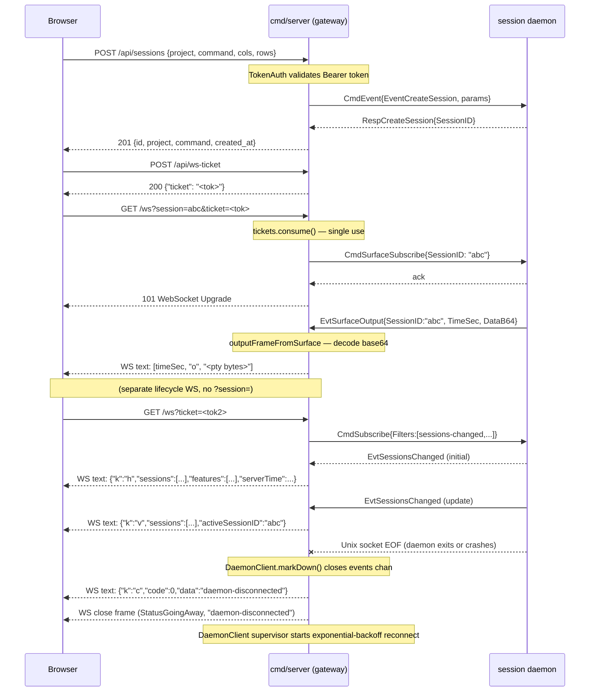

# Web Gateway

`server/web` is the HTTP/WebSocket gateway that bridges a browser to the
session daemon. It is a **stateless proxy**: session state lives entirely
in the daemon goroutines; this layer only translates between the browser
wire format and the daemon's internal proto types.

**Inner boundary** — `client/runtime` (the in-process session daemon) over a Unix socket.
**Outer boundary** — any browser client (xterm.js + React UI) over HTTPS/WSS.

Related documents:

- [ARCHITECTURE.md](../../ARCHITECTURE.md#server-gateway-server) — layer
  boundaries and import rules.
- [docs/user/web-server.md](../user/web-server.md) — operator guide (startup
  flags, TLS, token management).

The gateway lives inside the `cmd/server` binary alongside the daemon
coordinator goroutine. It starts a `DaemonClient` (eager-dial + supervisor,
see [ADR 0012](../adr/0012-daemon-client-eager-dial-supervisor.md)) against
the in-process Unix socket, and mounts the REST API (`/api/`) and
WebSocket endpoint (`/ws`) behind a shared `http.ServeMux`. `/healthz` is
mounted outside the auth middleware so monitoring agents can reach it
without a token.

---

## Wire vocabulary

All WebSocket frames are UTF-8 JSON text frames. The framing rules are:

- **Server → browser**: either an asciicast v2 array (for terminal output) or a
  JSON object whose `"k"` field identifies the frame kind.
- **Browser → server**: always a JSON object with a `"k"` field.

Implementation source of truth: `src/server/web/wire.go` (`encodeServerEvent`,
type declarations) and `src/server/web/gateway.go` (`AttachLifecycleWS`,
`writeOutbound`, `readInbound`).

### Server → browser frames

#### `"o"` — terminal output (asciicast v2)

Encodes raw PTY bytes from the daemon as an asciicast v2 output event.

```json
[1718000000.123, "o", "<decoded pty bytes>"]
```

| Field | Type | Description |
|---|---|---|
| `[0]` | `float64` | `TimeSec` — Unix epoch with fractional seconds from the daemon event |
| `[1]` | `"o"` | Asciicast event kind literal |
| `[2]` | `string` | PTY bytes decoded from the daemon's base64 `DataB64` field |

Source event: `proto.EvtSurfaceOutput`. Produced only on a session-surface WS
(`/ws?session=<id>`).

#### `"h"` — hello (lifecycle connection seed)

Sent as the **first frame** on a lifecycle WebSocket (connected without
`?session=`). Seeds the browser with the current session list, active session,
and feature flags. Subsequent sessions-changed events use `"v"` instead.

```json
{
  "k": "h",
  "sessions": [{ "id": "abc", "project": "my-project", "command": "claude", "created_at": "2026-06-19T00:00:00Z" }],
  "activeSessionID": "abc",
  "features": ["transcript", "event-log"],
  "serverTime": 1718000000
}
```

| Field | Type | Description |
|---|---|---|
| `k` | `"h"` | Frame kind |
| `sessions` | `SessionInfo[]` | Current session list (never null — empty array when none) |
| `activeSessionID` | `string \| null` | Currently focused session ID. Go emits `""` (`omitempty`); browser codec treats both `null` and `""` as "none active" (see `codec.ts:70` null-fallback) |
| `features` | `string[]` | Server-advertised feature flags (never null — empty array when none) |
| `serverTime` | `int64` | Unix seconds at frame creation (clock sync reference) |

Source event: `proto.EvtSessionsChanged` (first occurrence on lifecycle WS).
See `encodeHelloFrame` in `gateway.go`.

#### `"v"` — view-update broadcast

Mirrors a `proto.EvtSessionsChanged` event to all attached browsers (lifecycle
WS). Sent after the initial `"h"` frame for every subsequent sessions-changed
event. See [ADR 0023](../adr/0023-view-update-broadcast-shape.md) for the
1:1 mirror design.

```json
{
  "k": "v",
  "sessions": [{ "id": "abc", "project": "my-project", "command": "claude", "created_at": "2026-06-19T00:00:00Z" }],
  "activeSessionID": "abc"
}
```

| Field | Type | Description |
|---|---|---|
| `k` | `"v"` | Frame kind |
| `sessions` | `SessionInfo[]` | Updated session list |
| `activeSessionID` | `string` | Active session ID, or `""` |

Source event: `proto.EvtSessionsChanged`. Defined by `viewUpdateFrame` in
`wire.go`.

#### `"tt"` — transcript tail

Delivers one new line appended to a session's transcript file. Used for live
streaming after the browser has fetched the backfill via
`GET /api/sessions/{id}/transcript`. See
[ADR 0025](../adr/0025-transcript-rest-backfill-then-ws-tail.md).

```json
{ "k": "tt", "sessionId": "abc", "line": "<transcript line text>" }
```

| Field | Type | Description |
|---|---|---|
| `k` | `"tt"` | Frame kind |
| `sessionId` | `string` | Session the line belongs to |
| `line` | `string` | Raw transcript line |

Source event: `proto.EvtSessionFileLine{Kind: "transcript"}`.

#### `"et"` — event-log tail

Delivers one new NDJSON line appended to a session's event-log file. Mirrors
the transcript tail design; the browser combines backfill from
`GET /api/sessions/{id}/event-log` with these live frames.

```json
{ "k": "et", "sessionId": "abc", "line": "<ndjson event line>" }
```

| Field | Type | Description |
|---|---|---|
| `k` | `"et"` | Frame kind |
| `sessionId` | `string` | Session the line belongs to |
| `line` | `string` | Raw NDJSON event line |

Source event: `proto.EvtSessionFileLine{Kind: "event-log"}`.

#### `"n"` — agent notification

Delivers an agent-generated notification (e.g. tool-call complete, permission
request). The browser displays this as a toast and auto-dismisses it per the
policy in [ADR 0027](../adr/0027-notification-toast-auto-dismiss-policy.md).

```json
{
  "k": "n",
  "sessionId": "abc",
  "cmd": 2,
  "title": "Permission required",
  "body": "Allow bash command?",
  "nowMs": 1718000000000
}
```

| Field | Type | Description |
|---|---|---|
| `k` | `"n"` | Frame kind |
| `sessionId` | `string` | Session that emitted the notification |
| `cmd` | `int` | OSC command code from the agent |
| `title` | `string` | Short title (may be `""`) |
| `body` | `string` | Longer body text (may be `""`) |
| `nowMs` | `int64` | Server Unix milliseconds at encode time |

Source event: `proto.EvtAgentNotification`. Defined by `notificationFrame` in
`wire.go`.

> Note: An older `"osc"` control-frame encoding also exists in
> `controlFrameFromNotification` for backward compatibility with legacy UI
> consumers. New code should use `"n"`.

#### `"r"` — WS response (RespOK)

> **Direction-collision note**: the ASCII character `"r"` is used for two
> completely different purposes depending on message direction. When the frame
> travels **browser → server** it is a terminal resize (see the Browser →
> server section below). When the frame travels **server → browser** it is a
> request-response reply (RespOK). Parsers must gate on message direction, not
> just on the `"k"` field.

Sent by the server as a successful reply to a browser-initiated WS request
(identified by `reqId`). Currently reserved for future WS-level request/reply
flows (e.g. subscribe responses); not emitted by the current server-side
Go implementation but consumed by the browser codec (`codec.ts:92`).

```json
{ "k": "r", "reqId": "req-001", "body": { ... } }
```

| Field | Type | Description |
|---|---|---|
| `k` | `"r"` | Frame kind (server → browser only; see collision note above) |
| `reqId` | `string` | Correlates to the browser request that triggered this reply |
| `body` | `unknown` | Optional response payload; shape is request-specific |

Type definition: `src/client/web/src/wire/server.ts:RespOKFrame`.

#### `"e"` — WS response error (RespErr)

Sent by the server as an error reply to a browser-initiated WS request.
Pairs with `"r"` in the request/reply protocol; not emitted by the current
server-side Go implementation but parsed by the browser codec (`codec.ts:96`).

```json
{ "k": "e", "reqId": "req-001", "code": "frame-not-ready", "message": "session not attached" }
```

| Field | Type | Description |
|---|---|---|
| `k` | `"e"` | Frame kind |
| `reqId` | `string` | Correlates to the browser request that triggered this error |
| `code` | `string` | Machine-readable error code (e.g. `"frame-not-ready"`, `"unauthorized"`) |
| `message` | `string` | Human-readable error description |

Type definition: `src/client/web/src/wire/server.ts:RespErrFrame`.

#### `"c"` — control / daemon disconnect

A general-purpose control frame sent on exceptional conditions. Currently used
exclusively for the daemon-disconnect signal in the 2-step close sequence
defined by [ADR 0011](../adr/0011-two-step-ws-close-on-daemon-disconnect.md).

```json
{ "k": "c", "code": 0, "data": "daemon-disconnected" }
```

| Field | Type | Description |
|---|---|---|
| `k` | `"c"` | Frame kind |
| `code` | `int` | Application-defined code (0 = no specific code) |
| `data` | `string` | Human-readable reason string |

The 2-step close sequence:

1. Server sends this JSON text frame (browser can display a reconnecting UI).
2. Server sends a WebSocket `StatusGoingAway` typed close frame.

---

### Browser → server frames

Inbound frames are JSON objects decoded into the `inbound` struct (`wire.go`).
Unknown `"k"` values are silently dropped.

#### `"i"` — terminal input

Forwards raw keyboard input to the PTY session.

```json
{ "k": "i", "d": "<input bytes as string>" }
```

| Field | Type | Description |
|---|---|---|
| `k` | `"i"` | Frame kind |
| `d` | `string` | Raw input bytes to forward to the PTY |

Dispatches to `Attacher.WriteRaw` → `proto.CmdSurfaceWriteRaw`.

#### `"r"` — terminal resize (browser → server)

> **Direction-collision note**: `"k":"r"` also appears in **server → browser**
> frames as the RespOK reply (see above). The shape is entirely different:
> browser-to-server uses `cols`/`rows`; server-to-browser uses `reqId`/`body`.
> Always check message direction before dispatching on `k`.

Notifies the gateway of a terminal size change. Ignored unless both `cols` and
`rows` are positive.

```json
{ "k": "r", "cols": 220, "rows": 50 }
```

| Field | Type | Description |
|---|---|---|
| `k` | `"r"` | Frame kind (browser → server only; see collision note above) |
| `cols` | `int` | New terminal width in columns (must be > 0) |
| `rows` | `int` | New terminal height in rows (must be > 0) |

Dispatches to `Attacher.Resize` → `proto.CmdSurfaceResize`.

#### `"s"` / `"u"` — subscribe / unsubscribe (client type definitions only)

The client-side TypeScript (`src/client/web/src/wire/client.ts`) defines
`SubscribeFrame` (`k:"s"`) and `UnsubscribeFrame` (`k:"u"`) with a `reqId`
and `sessionId`. These are **not currently decoded by the Go server** (`wire.go`
`inbound` struct and `applyInboundProto` handle only `"i"` and `"r"`).

They are reserved for a future WS-level subscribe/unsubscribe flow that would
complement or replace the current URL-query-based session selection, pairing
with the `"r"` (RespOK) / `"e"` (RespErr) server→browser frames by `reqId`.
Until that WS route is implemented, session subscription is established via
the `/ws?session=<id>` URL at connect time (REST-level subscribe).

---

**Subscription via URL query**: The browser selects session-surface mode or
lifecycle mode through the `/ws` URL, not via an inbound frame. See
`serveAttach` in `mux.go`:

- `/ws?session=<id>&ticket=<…>` — attaches to a specific session surface;
  the server calls `CmdSurfaceSubscribe` and streams `"o"`, `"tt"`, `"et"`,
  `"n"`, `"c"` frames.
- `/ws?ticket=<…>` (no `session`) — attaches to the lifecycle stream; the
  server streams `"h"` (once), then `"v"`, `"tt"`, `"et"`, `"n"`, `"c"`.

---

## REST endpoints

All REST endpoints require `Authorization: Bearer <token>` except `/healthz`.
The token is never sent in a URL query parameter. WebSocket attach uses a
short-lived single-use ticket (minted via `POST /api/ws-ticket`) so that the
bearer token never appears in a WS URL.

Session ID validation uses the allowlist pattern `^[a-zA-Z0-9_-]+$` (defined
in `transcript.go`, reference ADR 0026).

### Session management

#### `GET /api/sessions`

List all active sessions.

| | |
|---|---|
| Auth | Bearer token |
| Request body | none |
| Response `200` | `apiSessionInfo[]` — JSON array |
| Response `503` | `text/plain` — daemon unavailable |

`apiSessionInfo` shape:

```json
{ "id": "abc", "project": "my-project", "command": "claude", "created_at": "2026-06-19T00:00:00Z" }
```

#### `POST /api/sessions`

Create a new session.

| | |
|---|---|
| Auth | Bearer token |
| Request body | `apiCreateReq` JSON |
| Response `201` | `apiSessionInfo` — the created session |
| Response `400` | bad request body or invalid argument from daemon |
| Response `503` | daemon unavailable |

Request body:

```json
{ "project": "my-project", "command": "claude", "cols": 220, "rows": 50 }
```

`cols` and `rows` are optional (zero → daemon default). The gateway forwards
these as `state.LaunchOptions` inside `proto.CmdEvent{Event: EventCreateSession}`.

#### `DELETE /api/sessions/{id}`

Stop a session.

| | |
|---|---|
| Auth | Bearer token |
| Response `204` | session stopped (no body) |
| Response `404` | session not found |
| Response `503` | daemon unavailable |

### Transcript and event-log backfill

Both endpoints support byte-range reading via an `?offset=<n>` query parameter
and ETag-based conditional requests. Combined with the WS tail frames (`"tt"`,
`"et"`), they implement the backfill-then-tail pattern of
[ADR 0025](../adr/0025-transcript-rest-backfill-then-ws-tail.md).

#### `GET /api/sessions/{id}/transcript`

Serve the transcript file from `offset` to EOF.

| | |
|---|---|
| Auth | Bearer token |
| Query params | `offset=<bytes>` (default 0) |
| Response `200` | `text/plain; charset=utf-8` — file bytes from offset |
| Response `204` | offset is at or past EOF (nothing new) |
| Response `304` | `If-None-Match` matched ETag (no change) |
| Response `404` | session not found or no transcript |
| Response `503` | daemon unavailable |

ETag format: `"<sessionID>:<fileSize>"`.

#### `GET /api/sessions/{id}/event-log`

Serve the event-log (NDJSON) file from `offset` to EOF.

| | |
|---|---|
| Auth | Bearer token |
| Query params | `offset=<bytes>` (default 0) |
| Response `200` | `application/x-ndjson` — NDJSON lines from offset |
| Response `204` | offset is at or past EOF |
| Response `304` | ETag matched |
| Response `404` | session not found or no event-log |
| Response `503` | daemon unavailable |

### WebSocket ticket

#### `POST /api/ws-ticket`

Mint a single-use, short-lived ticket for one WebSocket attach. The browser
exchanges the token-authenticated REST call for a ticket, then uses the ticket
in the WS URL so the bearer token never appears in a URL (and therefore never
in server logs or browser history).

| | |
|---|---|
| Auth | Bearer token |
| Request body | none |
| Response `200` | `{"ticket": "<opaque string>"}` |

### WebSocket attach

#### `GET /ws`

Upgrade to WebSocket. Authenticated by single-use ticket only (no bearer token
in the URL).

| | |
|---|---|
| Auth | `?ticket=<…>` single-use ticket |
| Query params | `session=<id>` (optional), `ticket=<…>` (required) |
| Response `101` | WebSocket upgrade |
| Response `401` | ticket missing or already consumed |
| Response `503` | daemon unavailable |

Mode is determined by whether `?session=` is present (see Wire vocabulary
section above).

### Health

#### `GET /healthz`

Daemon health probe. No authentication required.

| | |
|---|---|
| Auth | none |
| Response `200` | `{"status":"ok","last_attempt_at":"<RFC3339>"}` |
| Response `503` | `{"status":"daemon-unavailable","last_attempt_at":"<RFC3339>"}` |

---

## Sequence diagram

The diagram below shows the five key flows: session creation, WebSocket attach,
terminal output streaming, view-update broadcast, and daemon disconnect with
the 2-step close.



---

## Related ADRs

The following ADRs document the decisions that shaped the gateway wire
protocol and architecture. Read these when you need the rationale behind
a specific design choice.

- [ADR 0005](../adr/0005-cmd-server-as-arc-daemon-gateway.md) — established
  `cmd/server` as the HTTP/WS gateway fronting the session daemon; defined
  the stateless-proxy architecture and the Unix-socket boundary. The current
  layout (since phase F-E) co-resides daemon and gateway in one process; the
  proxy contract still holds across the in-process socket.

- [ADR 0006](../adr/0006-surface-namespace-for-new-proto-commands.md) — unified
  the `CmdSurface*` / `EvtSurface*` prefix in the proto layer; the gateway's
  `CmdSurfaceSubscribe`, `CmdSurfaceWriteRaw`, `CmdSurfaceResize` commands
  derive from this naming.

- [ADR 0011](../adr/0011-two-step-ws-close-on-daemon-disconnect.md) — mandates
  the 2-step close sequence (control `"c"` frame then WebSocket `StatusGoingAway`
  close frame) when the daemon disconnects, giving the browser time to display a
  reconnecting state before the WS tears down.

- [ADR 0012](../adr/0012-daemon-client-eager-dial-supervisor.md) — specifies
  the eager-dial + full-jitter exponential-backoff supervisor in `DaemonClient`;
  the `Health()` predicate that gates every REST handler is a direct consequence.

- [ADR 0023](../adr/0023-view-update-broadcast-shape.md) — defines the `"v"`
  frame as a 1:1 mirror of `proto.EvtSessionsChanged`; the `viewUpdateFrame`
  struct in `wire.go` implements this contract exactly.

- [ADR 0025](../adr/0025-transcript-rest-backfill-then-ws-tail.md) — defines
  the backfill-then-tail strategy: the browser fetches historical bytes via
  `GET /api/sessions/{id}/transcript` (or `event-log`), records the byte offset,
  then streams new lines from the `"tt"` / `"et"` WS frames.

- [ADR 0027](../adr/0027-notification-toast-auto-dismiss-policy.md) — specifies
  how the browser consumer of `"n"` frames should auto-dismiss notification
  toasts; the `nowMs` field in the notification frame is the timestamp reference.
